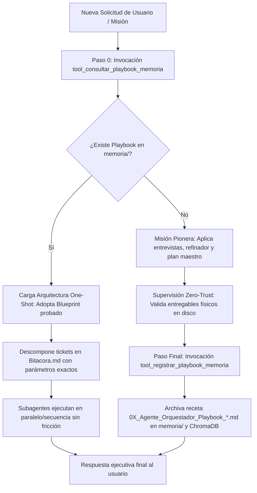

# Habilidad: Auto-Aprendizaje Continuo y Memoria Procedural (Agente_Orquestador)

**Identificador Canónico:** `auto_aprendizaje`  
**Paquete:** `skills/auto_aprendizaje/`  
**Agente Responsable:** `Agente_Orquestador` (Luffy)  
**Herramientas Principales:** `tool_consultar_playbook_memoria`, `tool_registrar_playbook_memoria`  
**Estado:** Activo / Producción (Estándar 5 Reglas de Oro)

---

## 1. Misión y Propósito de la Habilidad

Permite al **Agente Orquestador** aprender acumulativamente de cada arquitectura técnica, flujo y misión resuelta con éxito, almacenando su ADN metodológico en la memoria procedural (`memoria/` y ChromaDB):

1. **Paso 0 Obligatorio (Consulta antes de crear):** Ante cualquier solicitud de diseño web, dashboard, flujo n8n, conexión MCP o API, el Orquestador primero consulta `tool_consultar_playbook_memoria` para determinar si existe una arquitectura o pipeline probado. Si existe, lo adopta como blueprint base y coordina a los subagentes en **One-Shot**, evitando preguntas o pasos exploratorios innecesarios.
2. **Paso Final Obligatorio (Registro de primera vez):** Si la misión fue pionera y superó la supervisión física Zero-Trust, el Orquestador extrae y archiva la receta completa (pipeline de skills, subagentes involucrados, esquema de configuración, blueprint y variables de personalización) mediante `tool_registrar_playbook_memoria`.

---

## 2. Ciclo de Ejecución Operativo



---

## 3. Directivas de System Prompt (Inyección Dinámica)

```markdown
[🧠 DIRECTIVA MAESTRA: AUTO-APRENDIZAJE CONTINUO Y MEMORIA PROCEDURAL]
Tienes la capacidad de acumular conocimiento procedural para orquestar y ejecutar misiones complejas en UN SOLO PASO (One-Shot):

1. PASO 0 OBLIGATORIO — CONSULTA ANTES DE CREAR:
   - Ante CUALQUIER requerimiento de diseño web, dashboard, flujo n8n, conexión MCP, API o arquitectura multi-agente, tu PRIMERA ACCIÓN debe ser invocar:
     `tool_consultar_playbook_memoria(tema_o_dominio="...")`
   - Si se encuentra un Playbook previo:
     * Adopta la arquitectura, pipeline de skills y tickets recomendados como plantilla base probada.
     * Adapta únicamente las variables específicas del nuevo cliente/orden.
     * Delega y coordina la ejecución en One-Shot evitando redundancias o entrevistas innecesarias sobre temas ya resueltos.

2. PASO FINAL OBLIGATORIO — REGISTRO DE PRIMERA VEZ (FIRST-RUN):
   - Si la misión se realizó por primera vez (no existía Playbook previo) y superó la supervisión física Zero-Trust con éxito, antes de cerrar el ticket DEBES invocar:
     `tool_registrar_playbook_memoria(...)`
   - Esto archivará el pipeline de delegación, tokens, blueprint maestro y variables adaptables en `memoria/` y ChromaDB.
```

---

## 4. Herramientas Especializadas y Entregables

| Herramienta | Parámetros | Tipo Retorno | Descripción Operativa |
| :--- | :--- | :---: | :--- |
| `tool_consultar_playbook_memoria` | `tema_o_dominio: str` | JSON | Escanea `memoria/` y ChromaDB buscando antecedentes de proyectos o flujos similares. |
| `tool_registrar_playbook_memoria` | `titulo, categoria, dominio, paso_a_paso_skills, tokens_y_esquema, blueprint_reutilizable, variables_adaptables, evidencia_fisica` | JSON | Genera un archivo Markdown indexado en `memoria/` e indexa la solución en la memoria vectorial. |

---

## 5. Ejemplos Few-Shot de Invocación

### Caso 1: Consulta Previa de Orquestación (Paso 0)
```python
tool_consultar_playbook_memoria.invoke({
    "tema_o_dominio": "ecosistema pizza dental n8n"
})
```

### Caso 2: Registro de Playbook Maestro (Paso Final)
```python
tool_registrar_playbook_memoria.invoke({
    "titulo": "Playbook Maestro: Orquestación de Flujo Unificado Pizzería y Odontología n8n",
    "categoria": "n8n_workflow",
    "dominio": "gastronomia_salud",
    "paso_a_paso_skills": "1. Subagente_Desarrollo (Scaffold y Nodes) -> 2. Subagente_Diseno (Visual Flow) -> 3. Subagente_Ciberseguridad (SAST Audit)",
    "tokens_y_esquema": "Webhook unificado con router Switch por 'tipo_pedido'. Nodos Postgres, Twilio y Google Sheets.",
    "blueprint_reutilizable": "{\"nodes\": [{\"parameters\": {\"httpMethod\": \"POST\"}, \"type\": \"n8n-nodes-base.webhook\"}]}",
    "variables_adaptables": "- Webhook path\n- Credenciales Postgres y API keys externas",
    "evidencia_fisica": "/app/Subagente_Diseno/flujo_ecosistema_pizza_dental.json"
})
```

---
**Pertenece a:** [[Perfil_Agente_Orquestador]]
