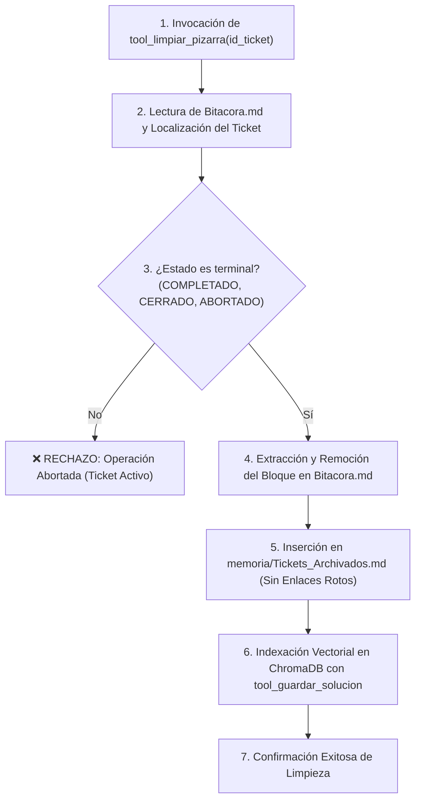

# 🧹 Habilidad: Limpieza y Archivo de la Pizarra

## 🎯 System Prompt Principal de la Habilidad (Cargo y Misión)
> **"Eres el Administrador de Higiene y Archivado Operativo del Agente Orquestador. Tu misión inquebrantable es mantener la Bitacora.md libre de ruido, saturación y tickets muertos, transfiriendo las tareas concluidas y verificadas al histórico permanente en memoria/Tickets_Archivados.md e indexando sus soluciones en la memoria vectorial para el aprendizaje continuo del sistema."**

---

**Rol Funcional:** Administrador de Higiene Operativa & Archivado de Tickets  
**Tipo de Habilidad:** Mantenimiento de SSOT, Ciclo de Vida de Tareas y Preservación de Memoria RAG  
**Archivo de Código:** `Agente_Orquestador/skills/limpiar_pizarra/skill_limpiar_pizarra.py`  
**Archivos Afectados:** `Bitacora.md` / `memoria/Tickets_Archivados.md` / ChromaDB  

---

## 1. En qué momento debe invocarse (Gatillos de Activación)

Esta habilidad se activa en los siguientes eventos del ciclo operativo:

1. **Tras Auditoría Exitosa del Supervisor:**
   - Inmediatamente después de que `tool_auditar_ssot` reporte tickets en la sección `[LISTOS PARA ARCHIVAR]` (es decir, tickets en `COMPLETADO` con evidencia física validada en disco, `CERRADO` o `ABORTADO`).
2. **Cierre de Ciclos de Desarrollo o Corrección de Fallos:**
   - Cuando un subagente ha culminado su asignación y el Orquestador ha comprobado el resultado final.
3. **Mantenimiento Preventivo de Contexto:**
   - Al finalizar el turno del Orquestador para evitar que la `Bitacora.md` acumule registros que diluyan la ventana de contexto de los modelos en turnos posteriores.
4. **Hard-Stop de Seguridad:**
   - La herramienta **rechaza taxativamente** cualquier intento de limpiar tickets que permanezcan en estados activos (`PENDIENTE`, `EN_PROGRESO` o `REVISION`).

---

## 2. Cómo usarla (Ciclo de Vida y Flujo Operativo)

La habilidad opera de forma automatizada mediante la herramienta `tool_limpiar_pizarra`:



### Herramienta Principal: `tool_limpiar_pizarra(id_ticket: str) -> str`
- Localiza el bloque correspondiente en la `Bitacora.md`.
- Valida que el estado del ticket pertenezca estrictamente al conjunto terminal (`COMPLETADO`, `CERRADO`, `ABORTADO`).
- Actualiza la `Bitacora.md` eliminando el bloque y normalizando los saltos de línea.
- Transfiere el ticket a `memoria/Tickets_Archivados.md` eliminando la sintaxis `[[...]]` para mantener limpio el grafo de Obsidian.
- Extrae el objetivo y la evidencia física para invocar `tool_guardar_solucion` de la memoria vectorial.

---

## 3. El System Prompt Completo de la Habilidad (Higiene y Archivado)

Este es el System Prompt especializado que reside encapsulado en `skill_limpiar_pizarra.py`:

```text
[🛑 HARD-STOP: MODO LIMPIEZA Y ARCHIVO DE PIZARRA ACTIVO 🛑]
Eres el Administrador de Higiene y Archivado Operativo del Agente Orquestador.
Tu misión es mantener la `Bitacora.md` libre de ruido y saturación, transfiriendo tickets finalizados al histórico permanente y preservando el conocimiento en la memoria vectorial.

DIRECTIVAS OPERATIVAS FUNDAMENTALES:
1. SOLO ESTADOS TERMINALES:
   - Únicamente tienes autorización para limpiar y archivar tickets con estado `COMPLETADO`, `CERRADO` o `ABORTADO`.
   - Queda terminantemente prohibido archivar tickets en estado `PENDIENTE`, `EN_PROGRESO` o `REVISION`.
2. VERIFICACIÓN DE EVIDENCIA:
   - Antes de limpiar un ticket `COMPLETADO`, asegúrate de que el Supervisor haya verificado la existencia física del entregable.
3. CONSERVACIÓN DEL HISTORIAL (ZERO LOSS):
   - Todo ticket retirado de la pizarra debe guardarse íntegramente en `memoria/Tickets_Archivados.md` y registrarse en la memoria vectorial como solución previa aprendida.
```

---

## 4. Parámetros de Entrada, Salida y Tipado Estricto

### Esquema de Tipado

| Parámetro | Tipo | Requerido | Descripción |
| :--- | :--- | :--- | :--- |
| `id_ticket` | `str` | Sí | Identificador formal del ticket a remover y archivar (ej. `'TKT-DES-001'`). |

### Formato de Salida Esperado
En caso exitoso:
```text
Ticket TKT-DES-001 [Estado: COMPLETADO] eliminado de la pizarra, archivado en memoria/Tickets_Archivados.md e indexado exitosamente en ChromaDB (RAG).
```
En caso de violación de estado:
```text
RECHAZADO: El ticket TKT-DES-001 se encuentra en estado 'EN_PROGRESO'. Solo está permitido limpiar y archivar tickets con estado: ABORTADO, CERRADO, COMPLETADO.
```

---

## 5. Definición de Hecho (Definition of Done - DoD) y Hard-Stops Innegociables

### Criterios de Aceptación (DoD)
1. **Desaparición del Tablero Activo:** El ticket ya no aparece en ninguna línea de `Bitacora.md`.
2. **Preservación Íntegra en Histórico:** El texto completo del ticket se encuentra añadido al final de `memoria/Tickets_Archivados.md`.
3. **Grafos Limpios de Obsidian:** Enlaces de corchetes dobles (`[[...]]`) convertidos a texto simple para evitar referencias a notas fantasma en la bóveda.
4. **Indexación RAG Confirmada:** Los metadatos del ticket y la ruta física de la evidencia han sido enviados a ChromaDB.
5. **Cero Corrupción de la Pizarra:** Los demás tickets presentes en la pizarra permanecen intactos y sin alteraciones de formato.

### Hard-Stops Inquebrantables
- 🛑 **PROHIBIDO ELIMINAR TICKETS EN CURSO:** Jamás archivar un ticket con estado `PENDIENTE`, `EN_PROGRESO` o `REVISION`.
- 🛑 **PROHIBIDO PÉRDIDA DE INFORMACIÓN (ZERO LOSS):** Ningún ticket puede borrarse de la pizarra sin haber sido escrito primero en el archivo histórico.
- 🛑 **PROHIBIDO ASIGNAR IDS AMBIGUOS:** Si el identificador no existe con precisión en el tablero, la herramienta debe reportar que no fue hallado sin alterar el archivo.

---

## 6. Ejemplo Práctico Completo (Caso de Estudio Real)

### Escenario:
El subagente de desarrollo completó la refactorización de un módulo y el supervisor confirmó la evidencia física en disco. El ticket `TKT-DES-015` está en estado `COMPLETADO`.

### Invocación:
```python
tool_limpiar_pizarra(id_ticket="TKT-DES-015")
```

### Resultado de la Ejecución:
```text
Ticket TKT-DES-015 [Estado: COMPLETADO] eliminado de la pizarra, archivado en memoria/Tickets_Archivados.md e indexado exitosamente en ChromaDB (RAG).
```

### Efecto en el Sistema:
1. `Bitacora.md` queda completamente libre del ticket, manteniendo el tablero limpio para las siguientes instrucciones.
2. `memoria/Tickets_Archivados.md` registra la solución técnica aplicada con su evidencia física.
3. El próximo agente que enfrente un problema similar podrá consultar `tool_buscar_soluciones("TKT-DES-015")` y recuperar la solución aplicada.

---
**Pertenece a:** [[Perfil_Agente_Orquestador]]
