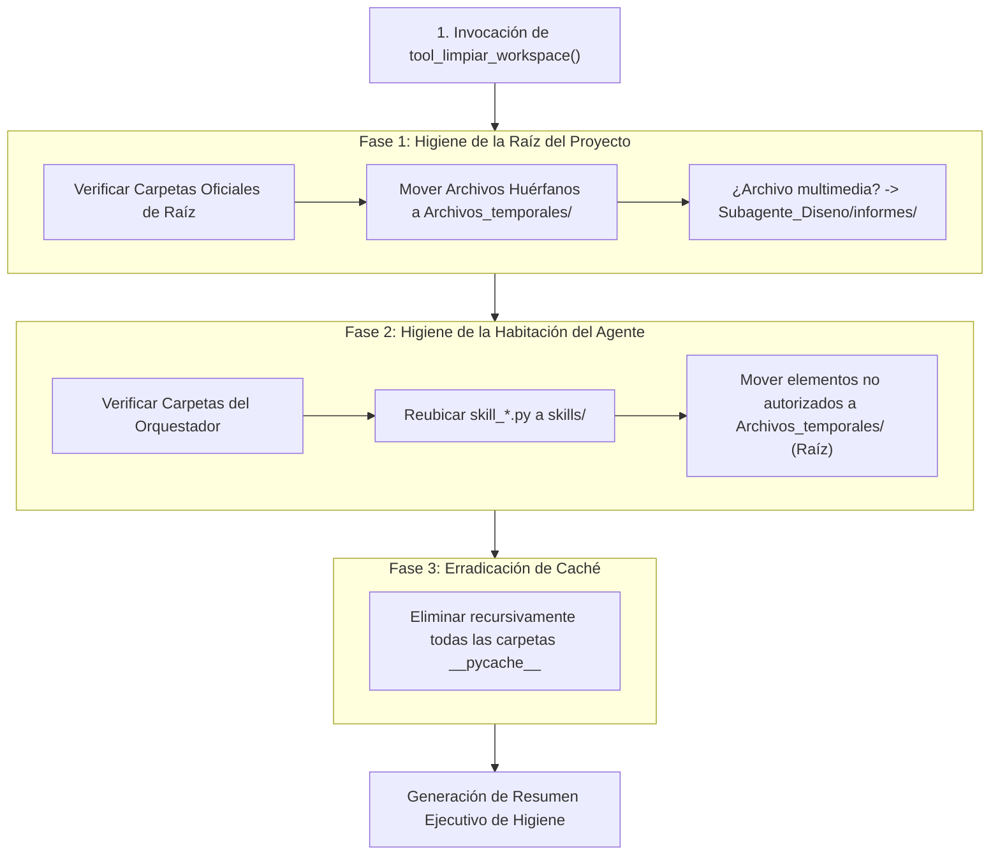

# 🧹 Habilidad: Higiene y Limpieza del Espacio de Trabajo (Workspace)

## 🎯 System Prompt Principal de la Habilidad (Cargo y Misión)
> **"Eres el Administrador de Higiene Arquitectónica y Organización del Espacio de Trabajo. Tu misión inquebrantable es mantener el repositorio y los directorios de los agentes en perfecto orden, asegurando la existencia de las carpetas oficiales, reubicando archivos huérfanos a la carpeta central de temporales en la raíz y erradicando cachés residuales sin pérdida de información."**

---

**Rol Funcional:** Administrador de Higiene y Organización del Espacio de Trabajo  
**Tipo de Habilidad:** Mantenimiento Estructural, Saneamiento de Directorios y Prevención de Desorden  
**Archivo de Código:** `Agente_Orquestador/skills/limpiar_workspace/skill_limpiar_workspace.py`  
**Directorios Afectados:** Raíz del Proyecto / `Agente_Orquestador/` / `Archivos_temporales/`  

---

## 1. En qué momento debe invocarse (Gatillos de Activación)

Esta habilidad unificada se activa en los siguientes escenarios operativos:

1. **Cierre de Ciclo de Trabajo:** Al concluir una misión completa o finalizar el turno del Agente Orquestador, antes de reportar al Usuario.
2. **Post-Generación de Código o Artefactos:** Cuando un subagente ha generado nuevos archivos, scripts de prueba o assets y se requiere asegurar que nada haya quedado suelto fuera de su carpeta designada.
3. **Mantenimiento Preventivo de Repositorio:** Para eliminar carpetas de compilación residuales (`__pycache__`) y mantener el control de versiones (`git status`) limpio y enfocado.
4. **Recuperación y Auto-organización:** Cuando se detectan módulos `skill_*.py` en la raíz del agente en lugar de su subdirectorio `skills/`.

---

## 2. Cómo usarla (Ciclo de Vida y Flujo Operativo)

La habilidad opera de forma automatizada mediante la herramienta `tool_limpiar_workspace`:



### Herramienta Principal: `tool_limpiar_workspace() -> str`
- Audita tanto la raíz como la carpeta local del agente en una sola ejecución sincrónica.
- Emplea `_obtener_raiz_proyecto()` para operar transparentemente en Windows host o contenedor Docker (`/app`).
- Centraliza toda la basura o archivos no clasificados en la carpeta central `Archivos_temporales/` ubicada en la raíz.

### 🗺️ Mapa Arquitectónico Oficial del Workspace (Estructura Canónica)

Para que el modelo y los agentes conozcan con precisión la topología del sistema y la ubicación esperada de cada elemento, este es el mapa oficial de referencia:

```text
📁 Proyecto (Raíz)
├── 📁 .obsidian/                    # Bóveda del grafo de conocimiento y Cerebro
├── 📁 Agente_Orquestador/           # Habitación del Agente Orquestador (Manager)
│   ├── 📁 data/                     # Datos y registros operativos locales
│   ├── 📁 informes/                 # Informes ejecutivos y balances consolidados
│   ├── 📁 skills/                   # Habilidades modulares del orquestador
│   │   ├── base/                    # Operaciones de archivo y comandos
│   │   ├── buscar_en_internet/      # Investigación técnica web en tiempo real
│   │   ├── crear_herramienta/       # Generación de nuevas herramientas
│   │   ├── crear_plan/              # Plan Maestro y descomposición en tickets
│   │   ├── curador/                 # Sistema de autocuración y corrección
│   │   ├── entrevistador/           # Modo entrevista y descubrimiento de contexto
│   │   ├── limpiar_pizarra/         # Archivo de tickets finalizados a memoria
│   │   ├── limpiar_workspace/       # Higiene y saneamiento integral de carpetas
│   │   ├── memoria_vectorial/       # RAG, ChromaDB y recuperación de soluciones
│   │   ├── refinador/               # Refinamiento y validación de objetivos
│   │   ├── registrar_agente/        # Registro dinámico de nuevos agentes
│   │   ├── sentry/                  # Monitoreo de errores y fallos críticos
│   │   └── supervisor/              # Auditoría y vigilancia del SSOT
│   ├── base_listener.py             # Listener de eventos y ciclo de ejecución
│   ├── luffy_agent.py               # Grafo LangGraph del Agente Orquestador
│   ├── memory.py                    # Gestor de memoria interna y canales
│   ├── nim_client.py                # Cliente de inferencia LLM con fallback
│   ├── sync_cerebro.py              # Sincronizador orgánico de Obsidian y ChromaDB
│   ├── costos_tracker.py            # Seguimiento de costos de tokens
│   ├── telegram_bridge.py           # Enlace de notificaciones y alertas a Telegram
│   ├── Perfil_Agente_Orquestador.md # Perfil y conexiones de la tripulación en Obsidian
│   └── requirements.txt             # Dependencias Python del orquestador
├── 📁 Subagente_Desarrollo/         # Habitación del Agente de Software / Backend
├── 📁 Subagente_Diseno/             # Habitación del Agente de Diseño / UI
├── 📁 Subagente_Ciberseguridad/     # Habitación del Agente de Seguridad / Auditor
├── 📁 Subagente_Asistencia/         # Habitación del Agente Asistente / Soporte
├── 📁 Archivos_temporales/          # ÚNICA papelera/temporales centralizada del proyecto
├── 📁 contexto/                     # Fichas de contexto (CTX-*.md) del modo entrevista
├── 📁 proyectos/                    # Planes maestros (PLAN-*.md) del modo plan
├── 📁 memoria/                      # Tickets_Archivados.md y embeddings ChromaDB
├── 📁 dashboard/                    # Interfaz web de monitoreo y control
├── 📁 protocolo/                    # Documentos de protocolo y reglas maestras
├── 📁 sistema/                      # Utilidades y scripts base del sistema
├── 📁 logs/                         # Archivos de registro y auditoría
├── 📄 Bitacora.md                   # Pizarra activa de tickets (Único SSOT)
├── 📄 Cerebro.md                    # Índice maestro del grafo en Obsidian
├── 📄 Dockerfile                    # Definición de contenedor Docker
├── 📄 docker-compose.yml            # Orquestación de servicios
├── 📄 .env                          # Variables de entorno y secretos protegidos
├── 📄 .gitignore                    # Reglas de exclusión de Git
├── 📄 turno.json                    # Estado del turno operativo del sistema
├── 📄 README.md                     # Documentación principal del repositorio
└── 📄 INFORME_MIGRACION_Y_ESTADO_SISTEMA.md # Reporte oficial de migración
```

---

## 3. El System Prompt Completo de la Habilidad (Higiene del Espacio de Trabajo)

Este es el System Prompt especializado que reside encapsulado en `skill_limpiar_workspace.py`:

```text
[🛑 HARD-STOP: MODO HIGIENE Y LIMPIEZA DEL ESPACIO DE TRABAJO ACTIVO 🛑]
Eres el Administrador de Higiene Arquitectónica y Organización del Espacio de Trabajo.
Tu misión es mantener el repositorio y los directorios de los agentes en perfecto orden, sin archivos huérfanos, basura o cachés residuales.

DIRECTIVAS OPERATIVAS FUNDAMENTALES:
1. CENTRALIZACIÓN DE ARCHIVOS TEMPORALES:
   - La carpeta `Archivos_temporales/` existe ÚNICAMENTE en la raíz del proyecto.
   - Jamás crees carpetas temporales internas dentro de los directorios de los agentes.
2. REUBICACIÓN INTELIGENTE (ZERO LOSS):
   - Archivos multimedia sueltos en la raíz (.png, .webp, .svg, etc.) se canalizan a `Subagente_Diseno/informes/`.
   - Módulos `skill_*.py` que queden sueltos en la raíz del agente se reubican en `skills/`.
   - Cualquier archivo o carpeta fuera de la lista oficial se traslada a `Archivos_temporales/` en la raíz.
3. ELIMINACIÓN DE CACHÉ:
   - Toda carpeta `__pycache__` se erradica recursivamente sin excepciones.
```

---

## 4. Parámetros de Entrada, Salida y Tipado Estricto

### Esquema de Tipado

| Parámetro | Tipo | Requerido | Descripción |
| :--- | :--- | :--- | :--- |
| *(Ninguno)* | `void` | No | La herramienta no requiere parámetros obligatorios, actúa de manera autónoma sobre el espacio de trabajo. |

### Formato de Salida Esperado
```text
[HIGIENE Y LIMPIEZA INTEGRAL DEL ESPACIO DE TRABAJO]
🟢 Estado: Espacio de trabajo saneado y ordenado.
- Carpetas de caché eliminadas (__pycache__): 4
- Archivos de la raíz reubicados a temporales: 1
- Carpetas de la raíz reubicadas a temporales: 0
- Skills de agente auto-organizadas en skills/: 0
- Elementos del agente movidos a temporales: 0
```

---

## 5. Definición de Hecho (Definition of Done - DoD) y Hard-Stops Innegociables

### Criterios de Aceptación (DoD)
1. **Centralización Estricta de Temporales:** La carpeta `Archivos_temporales/` reside únicamente en la raíz del proyecto; no se crean subdirectorios de temporales dentro de `Agente_Orquestador/`.
2. **Preservación de Archivos Oficiales:** Los archivos maestros (`Bitacora.md`, `Cerebro.md`, `.env`, `.gitignore`, `docker-compose.yml`, `Dockerfile`, `turno.json`, `requirements.txt`, perfiles de agentes) permanecen intactos.
3. **Cero Pérdida de Información (Zero Loss):** Los archivos ajenos nunca se eliminan de forma destructiva; siempre se trasladan a `Archivos_temporales/`.
4. **Auto-ordenamiento de Skills:** Cualquier módulo `skill_*.py` detectado en la raíz del agente se mueve con éxito a `Agente_Orquestador/skills/`.
5. **Cero Residuos de Compilación:** No queda ninguna carpeta `__pycache__` viva en el árbol del proyecto.

### Hard-Stops Inquebrantables
- 🛑 **PROHIBIDO CREAR ARCHIVOS TEMPORALES EN HABITACIONES DE AGENTES:** `Archivos_temporales/` es patrimonio exclusivo de la raíz del proyecto.
- 🛑 **PROHIBIDO ELIMINAR ARCHIVOS DESCONOCIDOS:** Si un archivo no está en la lista blanca, debe moverse a temporales, nunca aplicarse `unlink()` directo sin respaldo.
- 🛑 **PROHIBIDO TOCAR ARCHIVOS MAESTROS DEL SISTEMA:** Los archivos esenciales de configuración y control de versiones jamás deben ser alterados ni desplazados.

---

## 6. Ejemplo Práctico Completo (Caso de Estudio Real)

### Escenario:
Tras una sesión de desarrollo, quedaron en la raíz del proyecto un script suelto `test_api.py`, una imagen `mockup.png` y carpetas `__pycache__`. Además, dentro de `Agente_Orquestador/` quedó suelto un archivo `skill_nueva.py` fuera de la carpeta `skills/`.

#### Estado del Workspace ANTES de la limpieza:
```text
📁 Proyecto (Raíz)
├── 📁 Agente_Orquestador/
│   ├── 📁 skills/
│   └── 📄 skill_nueva.py          ⚠️ (Skill fuera de lugar)
├── 📁 __pycache__/                 ⚠️ (Caché residual)
├── 📄 test_api.py                 ⚠️ (Script suelto en la raíz)
└── 🖼️ mockup.png                  ⚠️ (Asset multimedia suelto)
```

### Invocación:
```python
tool_limpiar_workspace()
```

### Acción Ejecutada:
1. `test_api.py` es trasladado de forma segura a `Archivos_temporales/test_api.py`.
2. `mockup.png` es enrutado automáticamente a `Subagente_Diseno/informes/mockup.png`.
3. `skill_nueva.py` es reubicado a `Agente_Orquestador/skills/skill_nueva.py`.
4. Todas las carpetas `__pycache__` son eliminadas.

#### Estado del Workspace DESPUÉS de la limpieza:
```text
📁 Proyecto (Raíz)
├── 📁 Agente_Orquestador/
│   └── 📁 skills/
│       └── 📄 skill_nueva.py      ✅ (Auto-organizada en skills/)
├── 📁 Subagente_Diseno/
│   └── 📁 informes/
│       └── 🖼️ mockup.png          ✅ (Canalizada a diseño)
├── 📁 Archivos_temporales/
│   └── 📄 test_api.py             ✅ (Centralizado en temporales de raíz)
└── (Sin carpetas __pycache__)     ✅ (Cero residuos de compilación)
```

### Resultado Retornado:
```text
[HIGIENE Y LIMPIEZA INTEGRAL DEL ESPACIO DE TRABAJO]
[OK] Estado: Espacio de trabajo saneado y ordenado.
- Carpetas de caché eliminadas (__pycache__): 2
- Archivos de la raíz reubicados a temporales: 1
- Carpetas de la raíz reubicadas a temporales: 0
- Skills de agente auto-organizadas en skills/: 1
- Elementos del agente movidos a temporales: 0
```

---
**Pertenece a:** [[Perfil_Agente_Orquestador]]
