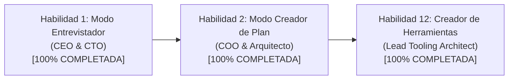

# 📋 INFORME INTEGRAL DE CAMBIOS, AUDITORÍA DE HABILIDADES Y PLAN DE MIGRACIÓN

**Fecha de Emisión:** 2026-09-30  
**Ubicación:** Raíz del Proyecto (`C:\Users\admin\Documents\Agentes\`)  
**Propósito:** Documento de transferencia, auditoría técnica de habilidades y hoja de ruta para la migración de nombres de carpetas desde la raíz del sistema.

---

## 1. Cambios y Mejoras Realizadas Hoy en el Sistema

### A. Rediseño Visual y Paleta de Colores del Panel de Control (Dashboard)
- **Tonalidad Cibernética de Alto Contraste:** Se refactorizó la paleta de colores del panel web (`dashboard/app.py`, estilos y plantillas), implementando un esquema oscuro con acentos de neón equilibrados (cian, fucsia y azul cobalto) optimizado para jornadas operativas continuas sin fatiga visual.
- **Tarjetas de Estado y Monitoreo:** Rediseño de los módulos de supervisión de hardware (CPU, GPU mediante GPUtil y memoria), registro de incidentes de seguridad e historial de intrusiones en tiempo real.
- **Pizarra y Selector de Modos en Vivo:** Interfaz reactiva para el selector de modo del agente (`Auto`, `Entrevista`, `Plan`), conectada de forma transparente con `dashboard/modo_agente.json`.

### B. Corrección Quirúrgica de Rutas y Eliminación de Duplicados
- **Erradicación del Bug `Luffy/Luffy`:** Se corrigió el cálculo de rutas relativas en `skill_entrevistador.py` que apuntaba a una subcarpeta duplicada interna (`parents[3]` vs `parents[1]`), eliminando completamente la carpeta duplicada del disco.
- **Unificación de la Carpeta de Creador de Herramientas:** Se identificó que existían dos carpetas para la misma función: `crear_herramienta` y `crear_herramienta_tripulacion`. Se consolidó todo en `crear_herramienta` y se eliminó por completo la carpeta duplicada obsoleta.
- **Limpieza de Archivos Marcadores (Stubs):** Se borraron del disco los archivos obsoletos de baja calidad que generaban ruido (`skill_crear_plan.md` y `Skill_Crear_Herramienta_Luffy.md`).

### C. Estructura y Salud del Grafo Digital en Obsidian
- **Centralidad en Tres Pilares:** La arquitectura de conocimiento quedó firmemente estabilizada en la trinidad central: `Bitacora.md`, `Cerebro.md` y `protocolo/Reglas de la Tripulacion.md`.
- **Cero Nodos Huérfanos:** Tras correr `sync_cerebro.py`, las 125 notas del grafo están interconectadas orgánicamente hacia los perfiles de los agentes y los pilares centrales.

---

## 2. Auditoría y Estandarización de Habilidades (Estándar de Oro)

### A. Principio de Aislamiento de Prompts (Anti-Dilución Predictiva)
- **El Problema:** Almacenar instrucciones extensas y system prompts especializados dentro del script principal del agente orquestador (`luffy_agent.py`) genera dilución de la atención predictiva del modelo de lenguaje, mezclando capacidades dispares (como generación de video con generación de imágenes).
- **La Solución Implementada:** Los system prompts especializados viven **estrictamente encapsulados** dentro de cada módulo de habilidad en su respectiva carpeta, accesibles mediante funciones dinámicas `obtener_prompt_<nombre_skill>()`. El archivo principal del agente solo contiene el loop orquestador y carga el prompt especializado en memoria únicamente cuando el modo o la herramienta están activos.

### B. Neutralidad Absoluta de Identidades (Abstracción por Roles)
- Se erradicaron de las habilidades los nombres personales ("Wuilfredo", "Will", "Capitán") y nombres de fantasía/piratas ("Luffy", "Zoro", "Nami", "Robin", "Sanji").
- Todas las especificaciones, código y documentación utilizan exclusivamente los roles funcionales del sistema:
  * **Usuario:** El operador humano (personalizable en perfiles).
  * **Agente Orquestador:** Supervisor y director de flujo.
  * **Subagente de Desarrollo Técnico:** Lógica de negocio, scripts, bases de datos y APIs.
  * **Subagente de Diseño, Interfaz y Arte Visual:** UI/UX, activos gráficos, prompts generativos.
  * **Subagente de Ciberseguridad y Auditoría:** Verificación de secretos, variables `.env`, permisos y hardening.
  * **Subagente de Asistencia Personal e Integraciones:** Notificaciones, mensajería, análisis documental.

### C. Las 5 Secciones Canónicas del Estándar de Oro
Toda habilidad estandarizada cuenta obligatoriamente con los siguientes componentes:
1. **System Prompt Principal en Cabecera:** Definición inequívoca del Cargo Profesional y la Misión central.
2. **Metadatos Técnicos:** Rol Funcional, Tipo de Habilidad, Ruta del Código Python y Directorio de Salida.
3. **1. En qué momento debe invocarse (Gatillos de Activación):** Definición clara del gatillo reactivo (orden humana) y autónomo (detección de cuellos de botella).
4. **2. Cómo usarla (Ciclo de Vida y Flujo Operativo):** Flujo paso a paso con diagrama de arquitectura o fases lógicas.
5. **3. El System Prompt Completo:** Texto literal íntegro del prompt encapsulado en el script.
6. **4. Resultados y Entregables Esperados:** Definición de artefactos físicos generados y criterios de aceptación (*Definition of Done*).
7. **5. Ejemplo Práctico Completo (Caso de Estudio Real):** Diálogo entre Usuario y Agente, invocación formal de la herramienta y visualización del archivo físico resultante.
8. **Conexión Exclusiva:** Enlace final `**Pertenece a:** [[Perfil_<Agente>]]`.

### D. Estado Actual de las Habilidades Auditadas

#### Habilidad 1: Modo Entrevistador Estratégico (`entrevistador/`)
- **Archivos:** `Agente_Orquestador/skills/entrevistador/skill_entrevistador.py` y `Agente_Orquestador/skills/entrevistador/Skill_Entrevistador_Agente_Orquestador.md`.
- **Rol:** CEO de Producto & CTO.
- **Innovación Clave:** Un solo archivo vivo persistente en `contexto/CTX-[Nombre_Proyecto].md`. Rondas ilimitadas de descubrimiento técnico y de negocio. Cero polución de notas temporales.

#### Habilidad 2: Modo Creador de Plan Maestro (`crear_plan/`)
- **Archivos:** `Agente_Orquestador/skills/crear_plan/skill_crear_plan.py` y `Agente_Orquestador/skills/crear_plan/Skill_Crear_Plan_Agente_Orquestador.md`.
- **Rol:** COO & Arquitecto de Soluciones Técnicas.
- **Innovación Clave:** Ingesta automática del último CTX. Desglose secuencial en fases estrictas con dependencias para evitar colisiones entre subagentes. Generación física en `proyectos/PLAN-[Nombre_Proyecto].md` con el borrador atómico de los tickets listos para la Pizarra.

#### Habilidad 12: Fábrica de Herramientas de la Tripulación (`crear_herramienta/`)
- **Archivos:** `Agente_Orquestador/skills/crear_herramienta/skill_crear_herramienta.py` y `Agente_Orquestador/skills/crear_herramienta/Skill_Crear_Herramienta_Agente_Orquestador.md`.
- **Rol:** Director de Ingeniería y Arquitecto de Plataforma (Tooling Lead).
- **Innovación Clave:** Fábrica automatizada que replica el estándar de oro. Si un subagente carece de una herramienta, el orquestador puede activarla de forma **autónoma** (sin esperar orden del usuario) para forjar la herramienta requerida, generar el script tipado con try-except, redactar las 5 secciones de documentación en markdown, abrir el ticket preventivo para el Subagente de Ciberseguridad y sincronizar con Obsidian.

---

## 3. Plan Maestro de Migración de Nombres de Carpetas

Para eliminar cualquier rastro de nombres de piratas y lograr una estructura de carpetas física 100% profesional, se ejecutará la migración desde la carpeta raíz del proyecto (`C:\Users\admin\Documents\Agentes\`).

### A. Nomenclatura Oficial Aprobada (Con Guiones Bajos)
Se seleccionó la convención con guiones bajos para garantizar compatibilidad absoluta con sistemas de archivos de Windows, rutas POSIX en Docker, imports de Python y terminales:

| Nombre Actual | Nuevo Nombre Oficial de Carpeta | Rol Funcional Asociado |
| :--- | :--- | :--- |
| `Luffy/` | `Agente_Orquestador/` | Director y Supervisor General |
| `Zoro/` | `Subagente_Desarrollo/` | Construcción de Software, APIs y QA |
| `Nami/` | `Subagente_Diseno/` | UI/UX, Composición Visual e IA Gráfica |
| `Robin/` | `Subagente_Ciberseguridad/` | Hardening, Auditoría y Gestión de Secretos |
| `Sanji/` | `Subagente_Asistencia/` | Integraciones, Mensajería y Despacho |

---

### B. Matriz de Componentes a Actualizar durante la Migración

1. **Panel de Control Web (`dashboard/app.py`):**
   - Actualizar rutas fijas: `LUFFY_DIR = AGENTES_DIR / "Agente_Orquestador"`.
   - Actualizar el monitor de procesos de agentes: mapeo a las nuevas rutas `Agente_Orquestador/luffy_agent.py`, `Subagente_Desarrollo/zoro_agent.py`, etc.
   - Actualizar el selector de archivos y lectura de bitácora/contexto.

2. **Memoria Compartida y Canales de Mensajería (`memory.py` en cada agente):**
   - Actualizar `MAPA_AGENTES` o directorios base para resolución de rutas relativas.
   - Soportar los nombres canónicos en el remitente y destinatario de mensajes (`de="Agente_Orquestador"`, `para="Subagente_Desarrollo"`).

3. **Motor de Sincronización del Cerebro (`sync_cerebro.py`):**
   - Actualizar la lista de escaneo de agentes:
     `["Agente_Orquestador", "Subagente_Desarrollo", "Subagente_Diseno", "Subagente_Ciberseguridad", "Subagente_Asistencia"]`.
   - Actualizar nombres de perfiles en Obsidian:
     `Perfil_Agente_Orquestador.md`, `Perfil_Subagente_Desarrollo.md`, etc.
   - Actualizar el saneamiento de enlaces: `**Pertenece a:** [[Perfil_<NuevoNombre>]]`.

4. **Entorno Docker (`docker-compose.yml` y variables):**
   - Si existen referencias a subcarpetas de agentes dentro de `docker-compose.yml` o scripts de arranque de contenedores, actualizar los nombres de los directorios montados.

5. **Scripts Principales de los Agentes (`*_agent.py` y `base_listener.py`):**
   - Ajustar las rutas en imports locales y referencias cruzadas entre agentes.

---

### C. Secuencia de Ejecución Paso a Paso

Una vez que abras la carpeta raíz `C:\Users\admin\Documents\Agentes` en Antigravity:

1. **Paso 1: Detención de Procesos Activos:**
   - Detener el proceso del dashboard (`dashboard/app.py`) y cualquier listener de agentes corriendo en segundo plano para liberar los locks de Windows sobre las carpetas.
2. **Paso 2: Renombrado Físico de las 5 Carpetas:**
   - Renombrar en disco `Luffy` a `Agente_Orquestador`.
   - Renombrar `Zoro` a `Subagente_Desarrollo`.
   - Renombrar `Nami` a `Subagente_Diseno`.
   - Renombrar `Robin` a `Subagente_Ciberseguridad`.
   - Renombrar `Sanji` a `Subagente_Asistencia`.
3. **Paso 3: Actualización Masiva de Rutas en Código:**
   - Aplicar el reemplazo controlado en `dashboard/app.py`.
   - Aplicar el reemplazo en `sync_cerebro.py`.
   - Actualizar `memory.py` y los scripts principales.
4. **Paso 4: Actualización del Grafo de Obsidian:**
   - Renombrar los archivos `Perfil_*.md` en Obsidian hacia la nueva nomenclatura.
   - Ejecutar `python Agente_Orquestador/sync_cerebro.py` para re-enlazar todo el cerebro sin enlaces rotos.
5. **Paso 5: Reinicio y Verificación del Dashboard:**
   - Iniciar nuevamente el dashboard y comprobar la lectura de los 5 agentes bajo sus nuevas rutas.

---
**Documento Certificado:** Listo para transición y apertura del espacio de trabajo desde la carpeta raíz `Agentes`.

---
**Pertenece a:** [[Perfil_Agente_Orquestador]]
