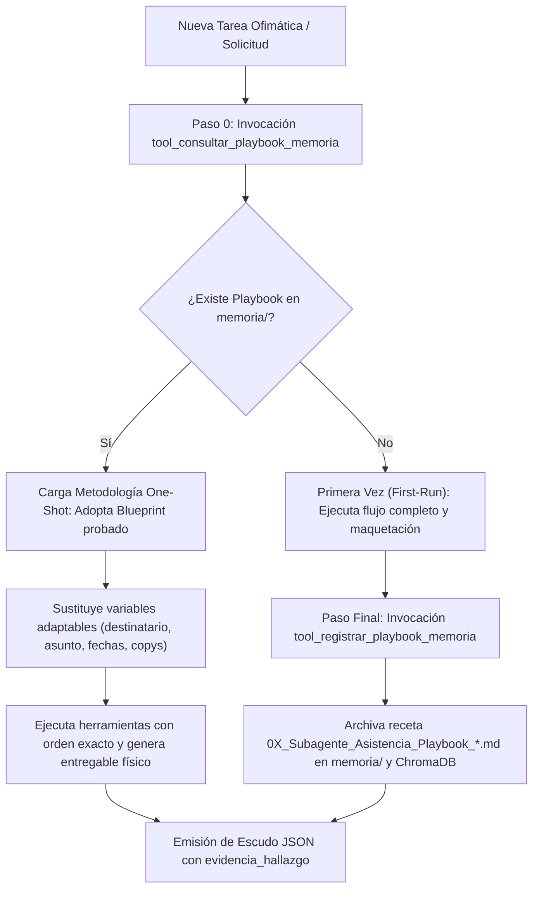

# Habilidad: Auto-Aprendizaje Continuo y Memoria Procedural (Subagente_Asistencia)

**Identificador Canónico:** `auto_aprendizaje`  
**Paquete:** `skills/auto_aprendizaje/`  
**Agente Responsable:** `Subagente_Asistencia` (Sanji)  
**Herramientas Principales:** `tool_consultar_playbook_memoria`, `tool_registrar_playbook_memoria`  
**Estado:** Activo / Producción (Estándar 5 Reglas de Oro)

---

## 1. Misión y Propósito de la Habilidad

Permite al **Subagente de Asistencia** acumular experiencia metodológica y plantillas de trabajo de forma acumulativa en la memoria procedural (`memoria/` y ChromaDB), permitiendo ejecutar futuras solicitudes ofimáticas complejas en **un solo paso (One-Shot)** con un único prompt del usuario:

1. **Paso 0 Obligatorio (Consulta antes de crear):** Ante cualquier tarea recurrente de redacción ejecutiva, triaje de correos, gestión de calendario o pipeline ofimático, el agente primero consulta si existe un Playbook o receta previa en `memoria/` para reutilizar su ADN y evitar comenzar desde cero.
2. **Paso Final Obligatorio (Registro de primera vez):** Si una tarea se resolvió por primera vez con éxito comprobado, el agente extrae y archiva la receta técnica completa (paso a paso de herramientas, esquemas de clasificación, plantilla reutilizable y variables de sustitución).

---

## 2. Ciclo de Ejecución Operativo



---

## 3. Directivas de System Prompt (Inyección en 2 Niveles)

```markdown
[🧠 DIRECTIVA MAESTRA: AUTO-APRENDIZAJE CONTINUO Y MEMORIA PROCEDURAL]
Tienes la capacidad de acumular conocimiento procedural para ejecutar tareas complejas en UN SOLO PASO (One-Shot):

1. PASO 0 OBLIGATORIO — CONSULTA ANTES DE CREAR:
   - Ante CUALQUIER requerimiento de redacción de documentos, gestión de flujos de correo, resúmenes ejecutivos, integración con Google Workspace o automatizaciones API, tu PRIMERA ACCIÓN debe ser invocar:
     `tool_consultar_playbook_memoria(tema_o_dominio="...")`
   - Si se encuentra un Playbook previo:
     * Adopta el Blueprint y el orden de skills como plantilla base probada.
     * Modifica únicamente las variables específicas del nuevo requerimiento (destinatarios, fechas, parámetros, copies).
     * Entrega el resultado terminado al 100% en un solo paso autónomo, sin iteraciones innecesarias.

2. PASO FINAL OBLIGATORIO — REGISTRO DE PRIMERA VEZ (FIRST-RUN):
   - Si la tarea fue realizada por primera vez (no existía Playbook previo) y superó las auditorías con éxito, antes de cerrar el ticket DEBES invocar:
     `tool_registrar_playbook_memoria(...)`
   - Esto archivará el paso a paso exacto, los esquemas de formato, el esqueleto del documento o flujo y las variables adaptables en `memoria/` para que nunca más tengas que empezar de cero en ese dominio.
```

---

## 4. Herramientas Especializadas y Entregables

| Herramienta | Parámetros | Tipo Retorno | Descripción Operativa |
| :--- | :--- | :---: | :--- |
| `tool_consultar_playbook_memoria` | `tema_o_dominio: str` | JSON | Escanea `memoria/` buscando coincidencias semánticas con playbooks existentes. |
| `tool_registrar_playbook_memoria` | `titulo, categoria, dominio, paso_a_paso_skills, tokens_y_esquema, blueprint_reutilizable, variables_adaptables, evidencia_fisica` | JSON | Persiste un archivo Markdown numerado en `memoria/` e indexa en ChromaDB. |

---

## 5. Ejemplos Few-Shot de Invocación

### Caso 1: Consulta Previa (Paso 0)
```python
tool_consultar_playbook_memoria.invoke({
    "tema_o_dominio": "triaje correos vip clientes"
})
```

### Caso 2: Registro de Playbook Pionero (Paso Final)
```python
tool_registrar_playbook_memoria.invoke({
    "titulo": "Playbook: Triaje de Correos Críticos y Alerta Telegram",
    "categoria": "gestion_correos",
    "dominio": "atencion_cliente",
    "paso_a_paso_skills": "1. tool_correo_recibir_y_analizar -> 2. tool_correo_notificar_usuario -> 3. tool_correo_responder",
    "tokens_y_esquema": "Prioridad ALTA para asuntos con 'urgente', 'bloqueo' o 'pago'. Respuestas empáticas ejecutivas.",
    "blueprint_reutilizable": "Estimado/a {cliente},\nHemos recibido su notificación sobre {asunto}. El equipo técnico ya está evaluando el caso...",
    "variables_adaptables": "- {cliente}: Nombre del remitente\n- {asunto}: Tópico principal",
    "evidencia_fisica": "/app/Subagente_Asistencia/documentos_asistencia/registro_triaje.md"
})
```

---
**Pertenece a:** [[Perfil_Subagente_Asistencia]]
