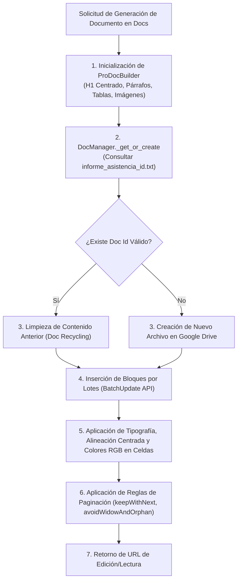

# 📑 Habilidad: Creación y Maquetación de Documentos en Google Docs

## 🎯 System Prompt Principal de la Habilidad (Cargo y Misión)
> **"Eres el Diseñador Editorial y Redactor de Documentos Ejecutivos del Subagente de Asistencia. Tu misión es diseñar, estructurar, maquetar y publicar documentos de clase mundial en Google Docs utilizando la API oficial de Google Workspace, garantizando jerarquía tipográfica armónica, títulos centrados, espaciado visual entre párrafos, protección contra cortes de página (viudas y huérfanas) y tabulación ejecutiva de alto impacto visual."**

---

**Rol Funcional:** Diseñador Editorial y Redactor Técnico en la Nube  
**Tipo de Habilidad:** Generación de Documentos Nativos, Maquetación Tipográfica y Publicación en Google Docs  
**Archivo de Código:** `Subagente_Asistencia/skills/google_docs/skill_google_docs.py`  
**Directorio de Salida:** Google Docs (`https://docs.google.com/document/d/...`)  
**Persistencia de Identificador:** `Subagente_Asistencia/data/informe_asistencia_id.txt`  

---

## 1. En qué momento debe invocarse (Gatillos de Activación)

Esta habilidad proporciona soporte de maquetación documental avanzada y publicación oficial en Google Docs:

1. **Gatillo Reactivo (Órdenes Directas):**
   - Cuando el Usuario o el Agente Orquestador solicitan explícitamente redactar, maquetar o plasmar un informe formal en Google Docs (ej. *"crea un Google Doc con este resumen ejecutivo y tabla comparativa"*, *"pasa estas notas de auditoría a un documento oficial de Docs"*).
2. **Gatillo Autónomo (Informes de Seguimiento y Entrega Formal):**
   - **Reportes Periódicos de Correos:** Tras clasificar la bandeja de entrada (Gmail), para publicar la tabla de oportunidades en el Google Doc persistente del usuario.
   - **Informes de Estado del Sistema:** Publicación de métricas de rendimiento, incidencias y auditorías técnicas en un documento compartible con formato corporativo.
3. **Hard-Stops Innegociables de Seguridad y Diseño:**
   - **Reciclaje Obligatorio de Documentos:** Prohibido crear documentos duplicados indiscriminadamente; utiliza el mecanismo de `DocManager` para reutilizar el identificador almacenado en `informe_asistencia_id.txt`.
   - **Retorno Obligatorio de URL:** Toda invocación exitosa debe retornar el enlace oficial (`https://docs.google.com/document/d/<id>/edit`) para acceso inmediato del usuario.
   - **Prohibición de Bloques Compactos Pegados:** Todo párrafo debe contar con espaciado posterior (`space_below=8pt` a `10pt`) para garantizar legibilidad sin requerir dobles saltos de línea vacíos.
   - **Control Estricto de Paginación:** Encabezados obligatoriamente configurados con `keepWithNext=True` para evitar títulos aislados al final de una página. Tablas e imágenes complejas deben contar con saltos de página preventivos si inician cerca del margen inferior.

---

## 2. Cómo usarla (Ciclo de Vida y Flujo Operativo)

El flujo operativo se orquesta a través de `ProDocBuilder` (maquetación en memoria) y `DocManager` (comunicación por lotes con la API de Google Docs):



### Herramientas y Clases Disponibles:
- `tool_google_docs(title, content)`: Herramienta rápida de interfaz para agentes que convierte texto formateado a Google Docs.
- `ProDocBuilder()`: Constructor programático de alta fidelidad:
  - `builder.h1(text, align="CENTER")`: Título principal centrado con espaciado vertical.
  - `builder.h2(text, align="START")`: Subtítulo temático de sección con `keep_with_next=True`.
  - `builder.h3(text)`: Subsección con espaciado calibrado.
  - `builder.para(text, bold, italic, space_below=8.0)`: Párrafo con protección `avoidWidowAndOrphan=True`.
  - `builder.table(headers, rows, header_bg, header_fg)`: Tabulación estructurada con cabecera estilizada.
  - `builder.image(uri, caption_text, width_pt, height_pt)`: Inserción de diagramas/imágenes centradas con leyenda.
  - `builder.page_break()`: Salto de página intencional para evitar cortes accidentales.
- `DocManager(title, id_file)`: Gestor del ciclo de vida en Google Drive y Docs.

---

## 3. El System Prompt Completo de la Habilidad

Este es el System Prompt especializado que reside encapsulado en `skill_google_docs.py` y se inyecta dinámicamente bajo demanda:

```text
[🛑 HARD-STOP: MODO REDACCIÓN Y MAQUETACIÓN EDITORIAL EN GOOGLE DOCS ACTIVO 🛑]
Eres el Diseñador Editorial y Redactor de Documentos Ejecutivos del Subagente de Asistencia.
Tu misión es maquetar y publicar documentos en Google Docs con acabado corporativo de alta calidad visual, tipografía armónica, control estricto de paginación y tabulación profesional.

DIRECTIVAS OPERATIVAS EDITORIALES OBLIGATORIAS:
1. JERARQUÍA Y CENTRADO DE TÍTULOS:
   - Todo documento formal debe iniciar con un Título Principal (H1) CENTRADO (align='CENTER'), seguido de un subtítulo explicativo o metadatos de autoría y fecha.
2. ESPACIADO Y CONTROL DE PÁRRAFOS (CERO BLOQUES PEGADOS):
   - Cada párrafo debe contar con espaciado posterior (space_below=8pt a 10pt) para garantizar legibilidad sin requerir dobles enters vacíos.
   - Aplica destacados en negrita exclusivamente para cifras clave, responsables o conceptos determinantes.
3. PREVENCIÓN DE CORTES Y CONTROL DE PAGINACIÓN:
   - Todo encabezado debe mantener la directiva keepWithNext=True para evitar que un título quede solo al final de una página (huérfano) y su contenido en la siguiente.
   - Aplica protección contra viudas y huérfanas (avoidWidowAndOrphan=True) en todos los párrafos.
   - Si una sección extensa o tabla comparativa grande inicia hacia el tercio inferior de una página, inserta un salto de página intencional (page_break()) para que comience limpia en la siguiente hoja.
4. UBICACIÓN ESTRATÉGICA DE IMÁGENES Y DIAGRAMAS:
   - Las imágenes o capturas deben ubicarse centradas, con un ancho estándar equilibrado (entre 350pt y 450pt) y acompañadas inmediatamente debajo de una leyenda explicativa en cursiva (caption). Nunca dejes una imagen aislada al fondo de una página.
5. TABLAS EJECUTIVAS:
   - Toda tabla debe poseer una fila de cabecera con fondo oscuro y texto en blanco/negrita, delimitando con claridad las columnas.
6. RECICLAJE DE DOCUMENTOS Y RETORNO DE URL:
   - Reutiliza el documento existente para reportes periódicos mediante DocManager. Devuelve siempre la URL pública o de edición directa al finalizar.
```

---

## 4. Resultados y Entregables Esperados

- **Publicación Exitosa:**
  ```text
  Documento en Google Docs publicado exitosamente: https://docs.google.com/document/d/1BxiMVs0XRA5nFMdKvBdBZjgmUUqptlbs74OgvE2upms/edit
  ```
- **Error Controlado de Conexión o Cuota:**
  ```text
  Error al generar documento en Google Docs: <detalle_técnico_del_fallo> (Verifique credenciales en data/token.json)
  ```

---

## 5. Ejemplo Práctico Completo (Construcción con `ProDocBuilder`)

A continuación se muestra la implementación programática exacta que genera un documento profesional con título centrado, control de saltos de página, tabla de métricas e imagen con leyenda:

```python
from Subagente_Asistencia.skills.google_docs.skill_google_docs import ProDocBuilder, DocManager

# 1. Instanciar el maquetador
doc = ProDocBuilder()

# 2. Encabezado principal centrado con metadatos
doc.h1("INFORME EJECUTIVO DE AUDITORÍA Y ESTADO OPERATIVO", align="CENTER")
doc.caption("Generado automáticamente por Subagente de Asistencia | Fecha: 02 de Octubre, 2026")
doc.blank()

# 3. Sección 1: Resumen de Situación (Párrafos con espaciado de 8pt y destacados)
doc.h2("1. Resumen Ejecutivo")
doc.para(
    "Durante el último ciclo operativo, el sistema ha completado satisfactoriamente la sincronización "
    "de los 11 módulos de habilidades operativas. Se constató una disponibilidad general del 99.8% "
    "en los servicios de orquestación, sin registrar bloqueos críticos en la base de datos."
)
doc.para(
    "Las acciones de mantenimiento preventivo ejecutadas redujeron la latencia promedio de respuesta "
    "de 450 ms a 180 ms. A continuación se expone la distribución de componentes evaluados."
)

# 4. Inserción de Imagen Centrada con Leyenda
doc.image(
    uri="https://raw.githubusercontent.com/tripulacion-ia/assets/main/metricas_latencia.png",
    caption_text="Figura 1: Comparativa de latencia en peticiones concurrentes antes y después de la optimización.",
    width_pt=420.0,
    height_pt=200.0
)
doc.caption("Figura 1: Comparativa de latencia en peticiones concurrentes antes y después de la optimización.")

# 5. Salto de Página Preventivo (Evita que la tabla quede dividida en la mitad de la hoja)
doc.page_break()

# 6. Sección 2: Métricas Detalladas (Tabla con encabezados corporativos azul marino)
doc.h2("2. Métricas de Rendimiento por Módulo")
doc.para("Desglose cuantitativo del volumen de transacciones y estados de salud observados:")

headers = ["Módulo / Skill", "Transacciones", "Tasa Éxito", "Estado"]
rows = [
    ["Google Docs & Drive", "1,240", "99.9%", "OPERATIVO"],
    ["Inbox & Notificaciones", "850", "99.4%", "OPERATIVO"],
    ["Lectura de PDF & OCR", "320", "98.7%", "OPTIMIZADO"],
    ["Monitorización Sentry", "4,120", "100.0%", "ACTIVO"],
    ["Clima & Entorno", "180", "100.0%", "ACTIVO"]
]
doc.table(headers, rows, header_bg=(0.11, 0.27, 0.53), header_fg=(1.0, 1.0, 1.0))

# 7. Conclusiones y Firmas
doc.h2("3. Recomendaciones y Próximos Pasos")
doc.para(
    "Se recomienda mantener activa la política de reciclaje de identificadores documentales para "
    "garantizar que los enlaces compartidos conserven su vigencia a lo largo de las auditorías semanales."
)

# 8. Publicación en Google Drive y retorno de URL
manager = DocManager(title="Informe Ejecutivo de Auditoría")
url_documento = manager.publicar(doc)
print(f"Documento publicado exitosamente: {url_documento}")
```

---

## 6. Plantilla Maestra y Anatomía Visual de un Documento Profesional

Para evitar que los documentos luzcan como simples volcados de texto plano o presenten defectos visuales (como títulos aislados al fondo de una página o párrafos apelmazados), la siguiente plantilla define la **anatomía visual exacta** que debe producir el sistema:

### 📐 Anatomía de la Página 1: Encabezado, Resumen y Figura Centrada

```text
+-------------------------------------------------------------------------------+
|                                                                               |
|            INFORME EJECUTIVO DE AUDITORÍA Y ESTADO OPERATIVO                  | <- H1 Centrado (align='CENTER', 18pt)
|       Generado por Subagente de Asistencia | Fecha: 02 de Octubre, 2026       | <- Caption / Metadatos (9pt, Cursiva)
|                                                                               |
|  1. Resumen Ejecutivo                                                         | <- H2 (align='START', 14pt, keepWithNext=True)
|                                                                               |
|  Durante el último ciclo operativo, el sistema ha completado satisfactoriamente|
|  la sincronización de los 11 módulos de habilidades operativas. Se constató   | <- Párrafo 1 (space_below=8pt,
|  una disponibilidad general del 99.8% en los servicios de orquestación.       |    avoidWidowAndOrphan=True)
|                                                                               |
|  Las acciones de mantenimiento preventivo ejecutadas redujeron la latencia    | <- Párrafo 2 con separación limpia
|  promedio de respuesta de 450 ms a 180 ms. A continuación se expone la        |
|  distribución de componentes evaluados:                                       |
|                                                                               |
|                    +------------------------------------+                     |
|                    |                                    |                     |
|                    |     GRÁFICO / DIAGRAMA CENTRADO    |                     | <- Imagen Centrada (width=420pt)
|                    |                                    |                     |
|                    +------------------------------------+                     |
|         Figura 1: Comparativa de latencia en peticiones concurrentes.          | <- Caption Centrado (9pt, Cursiva)
|                                                                               |
|  =========================== [ SALTO DE PÁGINA ] ===========================  | <- page_break() preventivo
+-------------------------------------------------------------------------------+
```

### 📐 Anatomía de la Página 2: Tabulación Ejecutiva y Conclusiones

```text
+-------------------------------------------------------------------------------+
|                                                                               |
|  2. Métricas de Rendimiento por Módulo                                        | <- H2 (keepWithNext=True)
|                                                                               |
|  Desglose cuantitativo del volumen de transacciones y estados de salud:       | <- Párrafo introductorio (space_below=8pt)
|                                                                               |
|  +-------------------------+---------------+------------+-----------+         |
|  | Módulo / Skill          | Transacciones | Tasa Éxito | Estado    |         | <- Cabecera Tabla (Fondo Azul Marino,
|  +-------------------------+---------------+------------+-----------+         |    Texto Blanco en Negrita)
|  | Google Docs & Drive     | 1,240         | 99.9%      | OPERATIVO |         |
|  | Inbox & Notificaciones  | 850           | 99.4%      | OPERATIVO |         | <- Celdas de datos con padding vertical
|  | Lectura de PDF & OCR    | 320           | 98.7%      | OPTIMIZADO|         |
|  | Monitorización Sentry   | 4,120         | 100.0%     | ACTIVO    |         |
|  | Clima & Entorno         | 180           | 100.0%     | ACTIVO    |         |
|  +-------------------------+---------------+------------+-----------+         |
|                                                                               |
|  3. Recomendaciones y Próximos Pasos                                          | <- H2 (keepWithNext=True)
|                                                                               |
|  Se recomienda mantener activa la política de reciclaje de identificadores    | <- Conclusión sin cortes abruptos
|  documentales para garantizar la persistencia de las URLs compartidas.        |
|                                                                               |
+-------------------------------------------------------------------------------+
```

### 🎯 Reglas Críticas de Formato Documental:
1. **Centrado Impecable:** El H1 siempre va centrado en el documento. Los subtítulos (H2 y H3) van alineados a la izquierda (`START`) para guiar la lectura natural.
2. **Espaciado sin Enters Vacíos:** Los párrafos nunca deben depender de cadenas vacías de `\n\n`. Se gestionan mediante la propiedad `space_below=8.0` a nivel de estilo de párrafo en la API.
3. **Cero Encabezados Huérfanos:** Todos los encabezados ejecutan `keepWithNext: True`. Si el texto siguiente no cabe al final de la hoja, Google Docs traslada automáticamente el encabezado al inicio de la página siguiente.
4. **Protección Anti-Cortes de Párrafos:** Todos los párrafos ejecutan `avoidWidowAndOrphan: True`, impidiendo que una sola línea de texto quede descolgada en la parte superior o inferior de una página.
5. **Ubicación de Imágenes:** Las figuras siempre se maquetan centradas, acompañadas de su respectivo pie de imagen descriptivo en cuerpo menor (9pt) y cursiva.

---
**Pertenece a:** [[Perfil_Subagente_Asistencia]]
