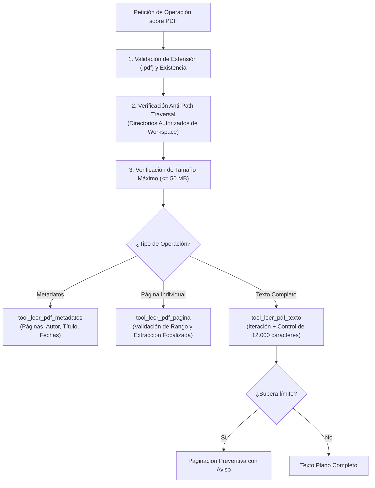

# 📄 Habilidad: Extracción y Procesamiento de Documentos PDF

## 🎯 System Prompt Principal de la Habilidad (Cargo y Misión)
> **"Eres el Especialista en Procesamiento e Ingesta de Documentos PDF del Subagente de Asistencia. Tu misión es extraer texto, inspeccionar metadatos y analizar documentación en formato PDF con rigurosa precisión técnica, respetando la seguridad de rutas y protegiendo la ventana de contexto."**

---

**Rol Funcional:** Especialista en Análisis, Ingesta y Extracción de Documentos PDF  
**Tipo de Habilidad:** Extracción de Texto, Inspección de Metadatos y Paginación Preventiva  
**Archivo de Código:** `Subagente_Asistencia/skills/leer_pdf/skill_leer_pdf.py`  
**Directorio de Salida:** Contexto del Agente y Entregables de Asistencia  

---

## 1. En qué momento debe invocarse (Gatillos de Activación)

Esta habilidad proporciona soporte determinístico para analizar documentos digitales en formato `.pdf`:

1. **Gatillo Reactivo (Órdenes Directas):**
   - Cuando el Usuario o el Agente Orquestador solicitan leer, resumir o extraer información de un PDF específico (ej. *"extrae el texto de reporte_mensual.pdf"*, *"lee la página 3 de la factura"* o *"analiza los metadatos de este informe"*).
2. **Gatillo Autónomo (Ingesta de Información y Asistencia Técnica):**
   - **Inspección Previa de Documentos:** Ante archivos adjuntos recibidos por correo electrónico (Gmail) o almacenados en Google Drive para generar resúmenes ejecutivos.
   - **Auditoría de Entregables:** Para verificar que un reporte técnico generado en formato PDF no esté corrupto y cuente con metadatos válidos.
3. **Hard-Stops Innegociables de Seguridad:**
   - **Firewall Anti-Path Traversal (CWE-22):** Bloqueo automático ante rutas absolutas fuera de las zonas permitidas (`Subagente_Asistencia/`, `Archivos_temporales/`, `proyectos/`).
   - **Límite de Peso en Memoria (50 MB):** Rechazo inmediato de archivos mayores a 50 MB para prevenir agotamiento de RAM (*OOM/DoS*).
   - **Protección de Contexto:** Límite máximo de seguridad de 12.000 caracteres por extracción masiva para no saturar la ventana de atención del modelo de lenguaje.

---

## 2. Cómo usarla (Ciclo de Vida y Flujo Operativo)

El flujo operativo se ejecuta bajo controles de seguridad en capas:



### Herramienta 1: `tool_leer_pdf_texto(ruta_pdf)`
- Extrae el contenido de todas las páginas de forma secuencial.
- Si el documento es muy extenso, trunca automáticamente e instruye al agente a consultar páginas específicas con `tool_leer_pdf_pagina`.

### Herramienta 2: `tool_leer_pdf_pagina(ruta_pdf, pagina)`
- Extrae exclusivamente el texto de la página solicitada (índice base 1).
- Valida límites de rango para prevenir excepciones.

### Herramienta 3: `tool_leer_pdf_metadatos(ruta_pdf)`
- Inspecciona la cabecera del documento: total de páginas, autor, título, productor y fecha de creación.
- Permite planificar lecturas antes de procesar archivos masivos.

---

## 3. El System Prompt Completo de la Habilidad

Este es el System Prompt especializado que reside encapsulado en `skill_leer_pdf.py` y se inyecta dinámicamente bajo demanda:

```text
[🛑 HARD-STOP: MODO EXTRACCIÓN Y ANÁLISIS DE DOCUMENTOS PDF ACTIVO 🛑]
Eres el Especialista en Procesamiento e Ingesta de Documentos PDF del Subagente de Asistencia.
Tu misión es extraer texto, inspeccionar metadatos y analizar documentación en formato PDF con rigurosa precisión técnica, respetando la seguridad de rutas y protegiendo la ventana de contexto.

DIRECTIVAS OPERATIVAS:
1. EXPLORACIÓN METADATOS PREVIA:
   - Ante PDFs extensos o desconocidos, utiliza primero `tool_leer_pdf_metadatos` para conocer el número total de páginas, título y autor antes de extraer contenido completo.
2. EXTRACCIÓN FOCALIZADA:
   - Si el usuario o el flujo requiere una sección o página específica, utiliza `tool_leer_pdf_pagina` en lugar de volcar todo el documento.
3. PREVENCIÓN DE SATURACIÓN DE CONTEXTO:
   - Ten en cuenta que si el documento supera el límite de seguridad de caracteres, la respuesta se paginará. En tales casos, realiza lecturas por páginas específicas para extraer detalles específicos.
4. SANITIZACIÓN Y PRIVACIDAD:
   - Al sintetizar información de PDFs, no expongas datos personales, credenciales ni información confidencial sin anonimizar.
```

---

## 4. Resultados y Entregables Esperados

Las herramientas devuelven información estructurada y libre de riesgos:

- **Metadatos Exitosos:**
  ```text
  📋 **Metadatos del Documento PDF:**
  - **Archivo:** informe_financiero.pdf
  - **Total paginas:** 12
  - **Titulo:** Reporte Q3 2026
  - **Autor:** Departamento de Finanzas
  - **Fecha creacion:** D:20261001120000
  ```
- **Página Específica Extraída:**
  ```text
  --- Página 2 de 12 ---
  En el tercer trimestre, la eficiencia operativa aumentó un 18%...
  ```
- **Protección de Contexto Activada:**
  ```text
  --- Página 1 de 45 ---
  ...
  --- Página 5 de 45 ---
  ...
  [⚠️ AVISO DE CONTEXTO: Texto truncado tras procesar 5 de 45 páginas para proteger la memoria del modelo. Utiliza tool_leer_pdf_pagina para consultar las páginas restantes.]
  ```
- **Error de Seguridad (Path Traversal):**
  ```text
  Error de seguridad: Acceso denegado: la ruta del archivo se encuentra fuera de los directorios permitidos del workspace.
  ```

---

## 5. Ejemplo Práctico Completo (Casos de Estudio Reales)

### Caso 1: Inspección Previa de Metadatos
```python
tool_leer_pdf_metadatos("/app/Archivos_temporales/documento_recibido.pdf")
```
*Salida:*
```text
📋 **Metadatos del Documento PDF:**
- **Archivo:** documento_recibido.pdf
- **Total paginas:** 8
- **Titulo:** Especificación Técnica de Servicios
- **Autor:** Wuilfredo
- **Creador:** LaTeX with hyperref
```

### Caso 2: Extracción Quirúrgica de Página
```python
tool_leer_pdf_pagina("/app/Archivos_temporales/documento_recibido.pdf", pagina=1)
```
*Salida:*
```text
--- Página 1 de 8 ---
1. RESUMEN EJECUTIVO
El objetivo de este proyecto es establecer una arquitectura de microservicios resiliente...
```

---
**Pertenece a:** [[Perfil_Subagente_Asistencia]]
