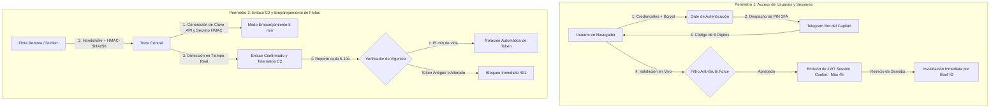
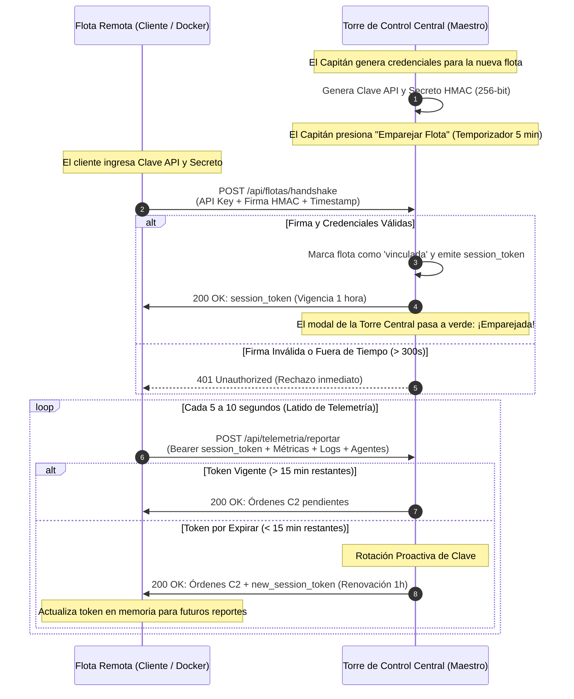

# Documento Técnico de Seguridad del Sistema
## Autenticación de Usuarios, Manejo de Sesiones y Protocolo Criptográfico de Flotas Remotas
**Sistema:** Tripulación IA / AgenticOS Architecture  
**Fecha:** Septiembre 2026  
**Auditoría y Arquitectura:** Torre de Control Maestro

---

## 1. Resumen Ejecutivo de Seguridad

El ecosistema de **Tripulación IA** implementa un modelo de seguridad por capas (**Defense in Depth**) diseñado para proteger tanto el acceso humano a la consola como la comunicación entre máquinas (M2M) distribuida en servidores de clientes o nodos remotos.

El sistema se divide en dos grandes perímetros defensivos:
1. **Seguridad de Acceso Humano (Inicio de Sesión, Registro y Sesiones Efímeras):** Cifrado de contraseñas con sal computacional (Bcrypt), autenticación de dos factores (2FA) en tiempo real mediante Telegram, sesiones firmadas criptográficamente con tokens JWT de duración estricta (máximo 4 horas), invalidación automática de sesiones al reiniciar el servidor e inmunidad anti-intrusión.
2. **Seguridad y Enlace C2 de Flotas Remotas (Master-Client & Docker C2):** Enlace simétrico de 256 bits, firmas de integridad HMAC-SHA256 contra ataques de repetición, tokens de sesión efímeros de vida corta (1h), rotación automática continua de credenciales, modo de emparejamiento con ventana temporal de 5 minutos, arquitectura C2 de conexión inversa (Reverse Outbound) y aislamiento multiarrendatario.

---

## 2. Seguridad de Inicio de Sesión y Control de Sesiones

### 2.1 Políticas y Cifrado de Contraseñas
- **Requisitos de Complejidad Obligatorios:**
  - Mínimo de 8 caracteres.
  - Al menos una letra mayúscula (`A-Z`).
  - Al menos un dígito numérico (`0-9`).
  - Al menos un carácter especial o símbolo (`!@#$%^&*...`).
- **Algoritmo de Hashing (Bcrypt):**
  - Las contraseñas nunca se almacenan en texto plano en la base de datos ni en memoria.
  - Se utiliza **Bcrypt** con un factor de costo computacional (salt) generado aleatoriamente para cada usuario. Esto hace inviable el uso de tablas arcoíris (*rainbow tables*) o ataques por diccionarios precalculados.

### 2.2 Doble Factor de Autenticación (2FA) por Telegram
Para evitar accesos no autorizados incluso si las credenciales fueran comprometidas, el sistema implementa un segundo factor de autenticación obligatorio:
- **Generación de PIN Efímero:** El sistema produce un PIN numérico aleatorio de 6 dígitos de alta entropía.
- **Canal Seguro Fuera de Banda (Out-of-Band):** El PIN se despacha exclusivamente a través de la API oficial de Telegram al canal privado del Capitán.
- **Validación en Backend (`POST /api/auth/validar-pin`):**
  - Las casillas del PIN en la interfaz web verifican el código en tiempo real contra el servidor mediante una solicitud segura.
  - Los códigos tienen una expiración estricta de 10 minutos y un solo uso. Si se ingresa un código incorrecto, el servidor responde con un código `403 Forbidden` y no permite continuar con el registro o acceso.
  - El botón de reenvío cuenta con un temporizador (*cooldown*) de 60 segundos por IP para evitar saturación o ataques de denegación de servicio (DoS) a la API de mensajería.

### 2.3 Manejo de Sesiones (JWT) de Alta Seguridad
- **Vigencia Reducida a 4 Horas:** Los tokens de sesión y cookies `access_token` tienen una vida útil máxima de 4 horas (`JWT_EXPIRATION_SECONDS = 14400`), mitigando riesgos de sesiones abandonadas en dispositivos compartidos.
- **Invalidación Cero-Tolerancia al Reiniciar Servidor:**
  - En cada arranque de la consola, el backend genera un identificador volátil de instancia (`SERVER_BOOT_INSTANCE_ID = secrets.token_hex(16)`).
  - La clave de firma del JWT (`JWT_SECRET_KEY`) se compone dinámicamente usando dicho identificador.
  - Como consecuencia, cualquier reinicio del servidor o de la consola invalida automáticamente todos los tokens generados con anterioridad. El navegador detecta el rechazo `401 Unauthorized` de `/api/auth/me`, limpia el almacenamiento residual (`localStorage`) y muestra inmediatamente el modal de inicio de sesión.

### 2.4 Escudo Perimetral y Alarma de Intrusión
- **Filtro de IPs Permitidas (Whitelist):** El Capitán puede configurar rangos de direcciones IP autorizadas (ej: `127.0.0.1`, subred local `192.168.0.*`).
- **Detección de Anomalías y Sirena en Vivo:** Los intentos sospechosos o de fuerza bruta se registran en `incidentes_seguridad.json`, activando alarmas visuales en el panel y avisos inmediatos a Telegram.

---

## 3. Seguridad de Conexión de Flotas Remotas (Master-Client C2)

La conexión entre la Torre de Control y las consolas o agentes desplegados en servidores de clientes (o PCs remotas) utiliza un protocolo criptográfico robusto diseñado para entornos de nube, contenedores Docker y redes locales con NAT.

### 3.1 Credenciales Criptográficas de Flota
Cada flota remota creada en la Torre de Control recibe un conjunto único de credenciales criptográficas que nunca se comparten con otros clientes:
1. **Fleet ID Oculto:** Identificador interno generado en backend (ej: `flota-casa-fd9b94`). Se mantiene oculto en la interfaz para mayor limpieza, permitiendo que el handshake se resuelva automáticamente a través de la Clave API.
2. **Master API Key:** Cadena segura generada criptográficamente mediante generador de números pseudoaleatorios de hardware (`secrets.token_urlsafe(24)`).
3. **Shared Secret (HMAC-SHA256):** Clave simétrica de 256 bits (`secrets.token_hex(32)`) utilizada exclusivamente para firmar peticiones y autenticar la identidad del nodo remoto.

### 3.2 Flujo de Emparejamiento (Pairing Workflow)
- **Activación:** Al hacer clic en "Emparejar Flota", la Torre de Control activa un estado de escucha con un radar visual parpadeante y una cuenta regresiva de 5 minutos (300 segundos).
- **Polling de Estado (`GET /api/flotas/estado/{fleet_id}`):** La consola maestra monitorea el estado del enlace cada 2.5 segundos.
- **Transición Automática:** En cuanto la flota remota realiza el handshake exitoso, la interfaz cambia instantáneamente a verde esmeralda confirmando la sincronización, actualiza las métricas y comienza a recibir telemetría en tiempo real sin recargar la página.

### 3.3 Protocolo de Apretón de Manos (Handshake) con Anti-Replay
- Cuando el conector de la flota remota arranca, realiza una llamada a `/api/flotas/handshake`.
- La petición incluye:
  - `api_key` (y opcionalmente `fleet_id`).
  - Cabecera `X-Fleet-Timestamp` con la hora Unix actual.
  - Cabecera `X-Fleet-Signature` que contiene la firma `HMAC-SHA256(secret_key, timestamp)`.
- **Protección Anti-Replay:** La marca de tiempo tiene una tolerancia máxima de 300 segundos (5 minutos). Pasado ese tiempo, la firma queda obsoleta y es rechazada.
- Tras validar la firma, la Torre de Control entrega un **Session Token** efímero.

### 3.4 Rotación Continua y Automática de Tokens de Sesión
- **Vida Útil Limitada:** Cada token de sesión tiene una validez máxima de 1 hora.
- **Rotación Proactiva sin Interrupción:**
  - En cada latido de telemetría (cada 5 a 10 segundos), el servidor comprueba el tiempo de vida restante del token.
  - Cuando restan menos de 15 minutos de vigencia, el servidor genera de manera autónoma un nuevo token efímero (`tok_...`), actualiza la base de datos de sesiones y lo incluye en el campo `new_session_token` de la respuesta JSON.
  - El daemon de la flota adopta el nuevo token inmediatamente en memoria para sus próximos reportes.
- **Invalidación Cero-Tolerancia:** Cualquier petición que intente usar un token anterior, expirado o manipulado recibe un código `401 Unauthorized` de inmediato.

### 3.5 Arquitectura C2 de Conexión Inversa (Reverse Outbound)
- Los clientes o agentes remotos en Docker **NO** necesitan abrir puertos entrantes (inbound) en sus routers ni firewalls locales.
- La conexión es saliente (outbound) hacia la Torre de Control central (mediante IP pública, dominio o Cloudflare Tunnel).
- El servidor central encola órdenes remotas (reiniciar agentes, aplicar parches, pausar tareas) y las entrega en el cuerpo de respuesta del siguiente latido del cliente.

### 3.6 Modo Cliente Restringido (`CLIENT_MODE=true`)
Cuando el sistema se replica para un cliente, se activa el modo restringido:
- **Aislamiento Multiarrendatario (Multi-Tenant Isolation):**
  - La consola del cliente no tiene acceso a la pestaña de Monitoreo de Flotas globales.
  - El cliente no puede ver la existencia, nombres, estados ni datos de ningún otro cliente o empresa.
  - Se ocultan las opciones de configuración de red perimetral, tokens de telemetría maestros y registros de intrusiones de la Torre de Control.
  - El cliente solo puede administrar su propio entorno local: sus agentes con nombres personalizados, sus tareas, su chat y sus propias llaves de modelos de lenguaje (OpenAI, Groq, etc.).

### 3.7 Revocación Inmediata de Acceso
Si el Capitán detecta alguna irregularidad o término de contrato:
- Al presionar el botón de eliminar o revocar en la lista de flotas registradas de la Torre de Control, la clave de la flota se elimina de la base de datos y de la memoria en tiempo real.
- A partir de ese milisegundo, cualquier latido posterior del contenedor del cliente es rechazado con error 401 y desconectado permanentemente del panel de mando.

---

## 4. Matriz de Mecanismos de Seguridad

| Capa de Seguridad | Tecnología Utilizada | Amenaza que Mitiga |
| :--- | :--- | :--- |
| **Almacenamiento de Contraseñas** | Bcrypt + Salt computacional aleatorio | Robo de base de datos, ataques de fuerza bruta, rainbow tables |
| **Segundo Factor de Acceso (2FA)** | PIN de 6 dígitos fuera de banda vía Telegram | Robo o filtración de contraseña maestra |
| **Verificación de PIN en Vivo** | Endpoint backend `validar-pin` con hard-stop 403 | Elusión del 2FA por manipulación de código en navegador |
| **Sesión de Usuario** | JWT con firma efímera por boot + Expiración 4h | Secuestro de sesión y persistencia indebida tras reinicios |
| **Perímetro de Red** | Whitelist de IPs + Alarma acústica y Telegram | Escaneos de puertos e intentos de acceso externo |
| **Autenticación de Flotas Remotas** | HMAC-SHA256 (256-bit secret) + Timestamp | Falsificación de reportes y ataques de repetición (Replay) |
| **Ventana de Emparejamiento** | Temporizador de 5 min con polling activo | Conexiones desatendidas y exposición prolongada de llaves |
| **Sesión de Flotas en Docker** | Tokens efímeros rotativos cada 45-60 min | Intercepción de tráfico de red y robo de credenciales |
| **Aislamiento de Clientes** | Variable `CLIENT_MODE` + contenedores Docker | Fuga de datos entre clientes y acceso a la consola maestra |
| **Control de Desconexión** | Revocación en 1 clic en base de datos maestra | Pérdida de control de servidores o nodos no autorizados |
| **Arquitectura de Red C2** | Conexiones salientes inversas (Reverse Outbound) | Exposición de puertos abiertos en servidores locales de clientes |

---

## 5. Recomendaciones de Buenas Prácticas para el Despliegue en Clientes

1. **Uso de HTTPS en Producción:** Asegurar que la Torre de Control central cuente con un certificado SSL/TLS (vía Cloudflare Tunnel, Caddy o Nginx) para que todo el tráfico viaje cifrado en tránsito sobre HTTPS.
2. **Protección de Variables de Entorno en Docker:** No compartir el archivo `.env` del cliente con personal no autorizado. Las variables `FLEET_API_KEY` y `FLEET_SECRET` deben considerarse credenciales críticas del sistema.
3. **Monitoreo de Rotaciones:** En el panel de flotas registradas, verificar periódicamente el contador de rotaciones realizadas para confirmar que los nodos clientes renuevan sus tokens con normalidad.

---
**Pertenece a:** [[Perfil_Luffy]]
