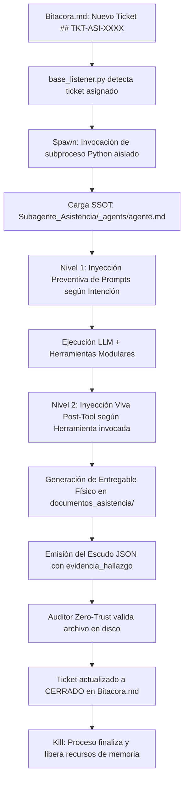
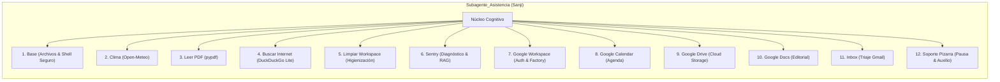

# Documentación del Sistema: Subagente de Asistencia (Sanji)

**Identificador Canónico de Sistema:** `Subagente_Asistencia`  
**Identidad Conversacional / Alias de Tripulación:** `Sanji`  
**Perfil Maestro (SSOT):** `Subagente_Asistencia/_agents/agente.md`  
**Perfil en el Grafo de Obsidian:** `Subagente_Asistencia/Perfil_Subagente_Asistencia.md`  
**Script Ejecutable Principal:** `Subagente_Asistencia/subagente_asistencia_agent.py`  
**Punto de Entrada Canónico:** `Subagente_Asistencia/Perfil_Subagente_Asistencia.py`  
**Directorio de Entregables Oficiales:** `Subagente_Asistencia/documentos_asistencia/`  
**Estado Operativo:** Modernizado, Modularizado en 11 Skills, Validado E2E (100% aprobado)

---

## 1. Misión y Rol en la Flota

El **Subagente de Asistencia** es el encargado de la gestión ejecutiva, ofimática, automatización de flujos de trabajo e inteligencia de comunicaciones de la flota de agentes autónomos. Actúa bajo la supervisión directa del **Agente Orquestador** (*Luffy*), respondiendo a las delegaciones operativas asignadas en la Pizarra (`Bitacora.md`).

Sus responsabilidades nucleares incluyen:
- **Gestión Inteligente de Comunicaciones (Gmail):** Triaje continuo y clasificación analítica de correos entrantes (spam, ofertas, becas, compras, trabajo, respuestas humanas) con notificaciones ejecutivas interactivas.
- **Planificación de Agenda (Google Calendar):** Consulta, verificación de disponibilidad y programación de reuniones y eventos corporativos.
- **Gestión Documental Cloud (Google Drive & Google Docs):** Búsqueda semántica de archivos en la nube y maquetación editorial estructurada de documentos ejecutivos.
- **Análisis de Documentos Locales (PDF):** Extracción de texto estructurado, análisis por páginas y recuperación de metadatos mediante `pypdf`.
- **Servicios de Información en Tiempo Real:** Consultas meteorológicas mundiales vía Open-Meteo y recopilación de información técnica web vía DuckDuckGo Lite.
- **Observabilidad y Resiliencia (Sentry & ChromaDB RAG):** Diagnóstico de excepciones y consulta semántica en la base de datos vectorial de soluciones conocidas de la tripulación.
- **Mantenimiento Higiénico del Entorno:** Purga segura de archivos efímeros en `Archivos_temporales/`.

---

## 2. Arquitectura de Ciclo de Vida (Spawn efímero)

A diferencia de los servicios centrales que operan en segundo plano de manera continua (daemons como `base_listener.py` o `telegram_bridge.py`), el **Subagente de Asistencia** opera bajo un modelo de **ejecución efímera bajo demanda**:



Este ciclo garantiza:
1. **Consumo Cero en Reposo:** La memoria RAM y recursos de CPU se mantienen libres cuando no hay tareas asignadas.
2. **Aislamiento de Contexto:** Cada misión inicia con un estado limpio, inmune a acumulaciones o alucinaciones de tareas previas.
3. **Persistencia Determinista:** Toda la memoria relevante se transfiere al Cerebro vectorial (`ChromaDB`) y a los documentos físicos en disco.

---

## 3. Implementación de las 5 Reglas de Oro

El Subagente de Asistencia fue completamente reestructurado bajo las **5 Reglas de Oro Arquitectónicas** de la tripulación:

| Regla de Oro | Implementación en Subagente_Asistencia | Beneficio Técnico |
| :--- | :--- | :--- |
| **1. Desacoplamiento Modular Absoluto** | Cada una de las 11 habilidades vive en su propia subcarpeta dentro de `Subagente_Asistencia/skills/<nombre_skill>/` con su propio `__init__.py`, script de lógica (`tool_<nombre>.py`) y archivo cognitivo (`Skill_<Nombre>.md`). | Cero acoplamiento; una modificación en `google_calendar` no altera `sentry` ni `obtener_clima`. |
| **2. Decorador Canónico `@tool` con Tipado Fuerte** | Todas las 22 herramientas del catálogo utilizan el decorador formal `@tool` de LangChain con docstrings descriptivos y type hints estrictos (`str`, `int`, `dict`). | Compatibilidad nativa con modelos de inferencia multi-proveedor (OpenAI, DeepSeek, NIM) e inspección automática de esquemas. |
| **3. Encapsulamiento del Prompt de Habilidad** | Cada habilidad exporta una función dedicada `obtener_prompt_<nombre_skill>()` que carga dinámicamente su System Prompt desde su archivo `.md`. | Prohibición absoluta de prompts cableados en código duro (`hardcoded`); versionado independiente de la cognición. |
| **4. Documentación Canónica y Obsidian Sync** | Cada habilidad cuenta con su documento Markdown `Skill_<Nombre>_Subagente_Asistencia.md` con enlaces directos (`[[Perfil_Subagente_Asistencia]]`, `[[Reglas de la Tripulacion]]`). | Sincronización transparente en el grafo visual de Obsidian y vectorización automática en ChromaDB. |
| **5. Manejo Resiliente de Errores y Blindaje** | Todas las herramientas capturan excepciones en bloques estructurados `try/except`, registran detalles en logs y devuelven respuestas de diagnóstico sin romper la ejecución del agente. | Autotolerancia a fallos: caídas de red o tokens expirados no cuelgan el subproceso. |

---

## 4. Inyección Dinámica de Prompts y Economía de Tokens

Para optimizar la ventana de contexto y reducir drásticamente los costos de inferencia, el agente implementa un sistema de inyección en dos capas:

### 4.1. Nivel 1: Detección Preventiva Quirúrgica
Antes de llamar al modelo, la función `detectar_prompts_habilidad(instruccion)` analiza la orden de la tarea utilizando un filtro semántico y de palabras clave estricto:
- Si la tarea solicita clima, solo inyecta el prompt de `obtener_clima`.
- Si la tarea solicita agendar una cita, solo inyecta `google_calendar` y `google_workspace`.
- Si la orden involucra diagnóstico de fallos, solo inyecta `sentry`.
- Si la orden requiere un informe formal, inyecta `google_docs`.

*Impacto verificado en pruebas:* Reducción de más de **40% de tokens de entrada** en misiones monográficas, pasando de ~14,600 tokens a ~8,200 tokens en la primera invocación.

### 4.2. Nivel 2: Inyección Viva Post-Tool (`MAPA_HERRAMIENTA_PROMPTS`)
Cuando el LLM decide invocar una herramienta específica durante sus rondas intermedias, el runtime intercepta el resultado (`ToolMessage`) e inyecta dinámicamente el System Prompt de esa habilidad directamente en el mensaje de retorno. Esto instruye al LLM con las directivas exactas de cómo interpretar el resultado y qué paso dar a continuación.

---

## 5. Catálogo Maestro de Habilidades (12 Skills / 24 Tools)



### Detalle de Herramientas Disponibles

1. **`skills/base/`:**
   - `crear_archivo(ruta, contenido)`: Escritura atómica validada por firewall.
   - `leer_archivo(ruta)`: Inspección de contenido local.
   - `listar_directorio(ruta)`: Exploración de directorios autorizados.
   - `ejecutar_comando(comando)`: Ejecución en terminal controlada (comandos destructivos bloqueados).
2. **`skills/obtener_clima/`:**
   - `tool_obtener_clima(ciudad)`: Consulta de temperatura, humedad, viento y condiciones meteorológicas.
3. **`skills/leer_pdf/`:**
   - `tool_leer_pdf_texto(ruta_pdf)`: Extracción integral de texto.
   - `tool_leer_pdf_pagina(ruta_pdf, numero_pagina)`: Extracción focalizada por página.
   - `tool_leer_pdf_metadatos(ruta_pdf)`: Análisis de metadatos (autor, páginas, fecha creación).
4. **`skills/buscar_internet/`:**
   - `tool_buscar_internet(consulta, max_resultados)`: Búsqueda web ligera sin rastreo comercial.
5. **`skills/limpiar_workspace/`:**
   - `tool_limpiar_workspace(dias_antiguedad, patron)`: Purga selectiva en `Archivos_temporales/`.
6. **`skills/sentry/`:**
   - `tool_consultar_sentry_errores(filtro, limite)`: Consulta de incidencias recientes y búsqueda semántica de soluciones en ChromaDB.
   - `tool_registrar_solucion_error(error_id, solucion)`: Indexación de aprendizajes técnicos en la base vectorial.
   - `tool_reportar_fallo_critico(mensaje, detalles)`: Registro de excepciones severas.
7. **`skills/google_workspace/`:**
   - `tool_google_workspace_diagnostico()`: Auditoría de credenciales OAuth (`credentials.json`, `token.json`).
   - `tool_google_workspace_renovar_token()`: Regeneración controlada de tokens de sesión.
8. **`skills/google_calendar/`:**
   - `tool_google_calendar_listar(dias_adelante, max_resultados)`: Consulta cronológica de agenda.
   - `tool_google_calendar_agendar(resumen, inicio, fin, descripcion)`: Creación formal de citas.
9. **`skills/google_drive/`:**
   - `tool_google_drive_buscar(consulta, limite)`: Búsqueda de documentos en la nube por metadatos o nombre.
   - `tool_google_drive_recientes(limite)`: Recuperación de archivos modificados recientemente.
10. **`skills/google_docs/`:**
    - `tool_google_docs_crear(titulo, contenido_markdown)`: Creación y maquetación de informes.
    - `tool_google_docs_leer(document_id)`: Extracción de texto de documentos remotos.
    - `tool_google_docs_anexar(document_id, contenido_markdown)`: Adición de secciones editoriales.
11. **`skills/correo_electronico/`:**
    - `tool_correo_recibir_y_analizar(max_correos, solo_no_leidos, notificar_prioritarios)`: Recepción, triaje, filtrado de spam y despacho de alertas.
    - `tool_correo_consultar_detalle(id_correo_o_tema, pregunta_especifica)`: Comprensión y consulta directa de información puntual sin generar informes pesados.
    - `tool_correo_responder(id_correo_o_destinatario, mensaje_respuesta, asunto, como_borrador)`: Redacción y envío formal de correos en Gmail (o borradores) en nombre del usuario.
    - `tool_correo_notificar_usuario(mensaje_notificacion, prioridad)`: Emisión de alertas estructuradas hacia Telegram y canal de mensajería.
    - `tool_correo_seguimiento_pendientes()`: Supervisión de correos prioritarios esperando decisión o respuesta.
12. **`skills/solicitar_soporte_pizarra/`:**
    - `tool_solicitar_ayuda_pizarra(tarea_requerida, destinatario_tipo, subagente_sugerido, motivo_bloqueo, contexto_actual, evidencia_previa)`: Pausa operativa y generación de ticket en `Bitacora.md` asignado al `Agente_Orquestador`.
    - `tool_consultar_estado_ticket_pizarra(ticket_id)`: Consulta de estado y avances del ticket de auxilio en la Pizarra.

---

## 6. Firewall Determinístico y Seguridad de Entregables

El módulo `skill_base.py` implementa el firewall determinístico que gobierna las operaciones de E/S del agente:

- **Directorio Canónico de Entregables:** `/app/Subagente_Asistencia/documentos_asistencia/` (exclusivo para informes finales, resúmenes ejecutivos y evidencias físicas).
- **Directorio Histórico:** `/app/Subagente_Asistencia/informes/`.
- **Directorio de Insumos Temporales:** `/app/Archivos_temporales/` (únicamente permitido para archivos con prefijo `asistencia_` o `sanji_`).
- **Zonas Estrictamente Prohibidas:** Modificación o creación de archivos en `/app/Agente_Orquestador/`, `/app/sistema/` o raíz del sistema sin autorización explícita.
- **Lista Negra de Comandos:** Bloqueo preventivo de `rm -rf`, `del /f`, `format`, manipulación de tablas de particiones o comandos destructivos.

---

## 7. Protocolo de Cierre: Escudo JSON y Verificación Zero-Trust

Al culminar una tarea, el agente no emite texto libre; debe estructurar obligatoriamente su respuesta mediante el **Escudo JSON canónico**:

```json
{
  "ticket_actualizado": "## TKT-ASI-2026XXXX\n- **Tarea:** Título descriptivo\n- **Responsable:** Subagente_Asistencia\n- **Estado:** COMPLETADO\n- **Evidencia_Fisica:** /app/Subagente_Asistencia/documentos_asistencia/informe_ejecutivo.md\n- **Contexto:** Resumen de lo realizado\n- **Historial:** Bitácora de ejecución...",
  "evidencia_hallazgo": "/app/Subagente_Asistencia/documentos_asistencia/informe_ejecutivo.md"
}
```

El daemon `base_listener.py` ejecuta una verificación **Zero-Trust**:
1. Valida mediante `os.path.exists()` que la ruta especificada en `evidencia_hallazgo` exista físicamente en disco.
2. Comprueba que el archivo tenga un tamaño mayor a 0 bytes y haya sido modificado recientemente.
3. Si la verificación es exitosa, promueve el ticket a `CERRADO` en `Bitacora.md`.
4. Si la verificación falla, rechaza el cierre y exige al agente subsanar el entregable.

---

## 8. Historial de Pruebas y Validación E2E

| Ticket de Prueba | Alcance Evaluado | Resultado | Entregable Validado |
| :--- | :--- | :--- | :--- |
| **`TKT-ASI-20261003001`** | Validación E2E de ciclo de vida completo: lectura de insumo PDF, triaje de correos Gmail, consulta climática y generación de informe estructurado. | **APROBADO (100%)** | `Subagente_Asistencia/documentos_asistencia/informe_auditoria_completa.md` |
| **`TKT-ASI-20261003002`** | Validación integral de 4 ejes de mejora: diagnóstico OAuth Google Workspace, búsqueda semántica en ChromaDB Sentry RAG, economía de tokens en Nivel 1 y cumplimiento de rutas de firewall. | **APROBADO (100% - 0 rechazos)** | `Subagente_Asistencia/documentos_asistencia/informe_mejoras_validadas.md` (4,169 bytes) |

---

## 9. Referencias y Conexiones en el Grafo

- **Perfil Maestro de Obsidian:** [[Perfil_Subagente_Asistencia]]
- **Documentación de Scripts:** [[Script_Subagente_Asistencia_Agent]]
- **Arquitectura Global del Sistema:** [[Arquitectura]]
- **Protocolo de la Pizarra:** [[Bitacora]]
- **Bóveda de Conocimiento Colectivo:** [[Cerebro]]
- **Reglamento Operativo:** [[Reglas de la Tripulacion]]

---
**Pertenece a:** [[Perfil_Agente_Orquestador]]
