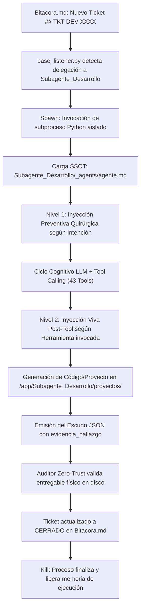

# Documentación del Sistema: Subagente de Desarrollo (Zoro)

**Identificador Canónico de Sistema:** `Subagente_Desarrollo`  
**Identidad Conversacional / Alias de Tripulación:** `Zoro`  
**Perfil Maestro (SSOT):** `Subagente_Desarrollo/_agents/agente.md`  
**Perfil en el Grafo de Obsidian:** `Subagente_Desarrollo/Perfil_Subagente_Desarrollo.md`  
**Script Ejecutable Principal:** `Subagente_Desarrollo/subagente_desarrollo_agent.py`  
**Punto de Entrada Canónico:** `Subagente_Desarrollo/Perfil_Subagente_Desarrollo.py`  
**Directorio de Entregables Oficiales:** `Subagente_Desarrollo/proyectos/`  
**Estado Operativo:** Modernizado, Modularizado en 21 Skills (71 herramientas especializadas + 5 base = 76 tools), SSOT Consolidado, Inyección en 2 Niveles, Memoria Procedural One-Shot.

---

## 1. Misión y Rol en la Flota

El **Subagente de Desarrollo** es el brazo ejecutor de ingeniería de software, arquitectura full-stack, aplicaciones móviles, control de versiones distribuido y automatización de procesos de la tripulación autónoma. Opera bajo la supervisión estratégica del **Agente Orquestador** (*Luffy*), atendiendo las misiones técnicas registradas en la Pizarra (`Bitacora.md`).

Sus responsabilidades primarias comprenden:
- **Desarrollo Backend y Entornos Python:** Creación de aplicaciones modulares, microservicios, aislamiento estricto mediante entornos virtuales (`.venv`) y gestión limpia de paquetes.
- **Desarrollo Frontend y Web Full-Stack:** Andamiaje y construcción de interfaces web semánticas y responsivas (HTML5/CSS3 moderno) y SPAs interactivas con React + Vite.
- **Desarrollo de Aplicaciones Móviles:** Scaffolding multiplataforma para iOS y Android bajo los frameworks Expo y React Native Bare.
- **Arquitectura de Componentes y Diseño UI/UX:** Aplicación de cinco corrientes estéticas mundiales (Anthropic editorial, UI/UX Pro Max, Emil design engineering de precisión 4px/8px, Huashu minimalista y Vercel/Next.js developer-first).
- **Control de Versiones Git:** Inicialización segura de repositorios con `.gitignore` preventivo obligatorio, branching, staging, commits semánticos e inspección de diferencias.
- **Automatización y Orquestación n8n:** Creación, validación sintáctica de esquemas JSON, almacenamiento y activación de flujos de trabajo en n8n.
- **Inspección Técnica de Nodos y Plantillas:** Consulta oficial a la API de esquemas de nodos de n8n para prevenir alucinaciones de propiedades, y reutilización de plantillas de la comunidad.
- **Exposición Perimetral y Pruebas Webhooks (Ngrok):** Creación de túneles temporales seguros para probar callbacks y webhooks externos en local.
- **Diagnóstico y Resiliencia con Sentry:** Detección de excepciones de software, consulta en memoria vectorial RAG de soluciones previas y registro de recetas de inmunización.
- **Higiene del Workspace:** Erradicación de archivos huérfanos y purga recursiva de cachés de compilación (`__pycache__`).

---

## 2. Arquitectura de Ciclo de Vida (Spawn Efímero)

El **Subagente de Desarrollo** opera bajo el paradigma de ejecución efímera bajo demanda (**Spawn -> Exec -> Kill**), orquestado por `base_listener.py`:



Ventajas clave del ciclo efímero:
1. **Aislamiento Absoluto de Memoria:** Cada tarea inicia sin contaminación de contexto previo ni variables residuales.
2. **Consumo Cero en Reposo:** No retiene memoria RAM ni ciclos de GPU/CPU cuando no existen requerimientos de desarrollo activos.
3. **Determinismo y Trazabilidad:** Todo cambio se refleja en archivos físicos en disco y commits trazables en Git.

---

## 3. Implementación de las 5 Reglas de Oro

La modernización del Subagente de Desarrollo se completó siguiendo rigurosamente las **5 Reglas de Oro Arquitectónicas**:

| Regla de Oro | Implementación en Subagente_Desarrollo | Beneficio Técnico |
| :--- | :--- | :--- |
| **1. Modularización Pura** | 20 paquetes independientes bajo `skills/<skill>/` con su propio `__init__.py`, `skill_<nombre>.py` y documentación Markdown. | Cero dependencias cruzadas entre herramientas; mantenimiento y pruebas unitarias aisladas. |
| **2. Documentación Espejo 5-Partes** | Cada una de las 20 habilidades contiene un archivo `Skill_<Nombre>_Subagente_Desarrollo.md` estructurado en las 5 secciones estándar. | Comprensión inmediata de gatillos de activación, ciclo operativo, system prompt, entregables y ejemplos few-shot. |
| **3. SSOT de Identidad sin Acoplamiento** | Identidad canónica única en `_agents/agente.md`. Ninguna skill contiene el alias conversacional (*Zoro*); las skills son herramientas técnicas puras. | Desacoplamiento total entre el cargo del agente (`Subagente_Desarrollo`) y el nombre conversacional configurable por el usuario. |
| **4. Inyección en 2 Niveles** | Nivel 1 detecta palabras clave en el prompt inicial para precargar directivas de la skill requerida. Nivel 2 inyecta en vivo el System Prompt de la skill tras la llamada a su herramienta. | Economía máxima de tokens iniciales sin perder la rigurosidad técnica durante la ejecución interactiva del LLM. |
| **5. Protocolo Zero-Trust y Escudo JSON** | Validación sintáctica del JSON de salida obligando a registrar `evidencia_hallazgo` con la ruta física comprobable en `proyectos/`. | El Orquestador nunca da por completada una tarea si el código, test o entregable no existe físicamente en el disco. |

---

## 4. Catálogo Consolidado de las 21 Habilidades (71 Herramientas Especializadas + 5 Nucleares)

| # | Habilidad | Paquete | Cantidad Tools | Herramientas Principales |
|---|---|---|---|---|
| 1 | **Base del SO** | `skills/base/` | 4 | `crear_archivo`, `leer_archivo`, `listar_directorio`, `ejecutar_comando` |
| 2 | **Git VCS** | `skills/git/` | 11 | `git_init`, `git_status`, `git_add`, `git_commit`, `git_log`, `git_branch`, `git_checkout`, `git_clone`, `git_pull`, `git_push`, `git_diff` |
| 3 | **Software Python** | `skills/software/` | 3 | `python_crear_venv`, `python_pip_instalar`, `python_ejecutar_script` |
| 4 | **Desarrollo Web** | `skills/web/` | 2 | `web_scaffold_html`, `web_scaffold_react` |
| 5 | **Desarrollo Móvil** | `skills/mobile/` | 2 | `mobile_scaffold_expo`, `mobile_scaffold_rn` |
| 6 | **Diseño Frontend** | `skills/frontend_design/` | 5 | `aplicar_frontend_design_anthropic`, `aplicar_ui_ux_pro_max`, `aplicar_emil_design_eng`, `aplicar_huashu_design`, `aplicar_vercel_guidelines` |
| 7 | **Flujos n8n** | `skills/n8n/` | 4 | `n8n_guardar_workflow`, `n8n_api_call`, `n8n_activar_workflow`, `n8n_iniciar` |
| 8 | **Nodos n8n** | `skills/n8n_docs/` | 2 | `n8n_buscar_nodos`, `n8n_leer_parametros_nodo` |
| 9 | **Plantillas n8n** | `skills/n8n_templates/` | 2 | `n8n_buscar_plantillas`, `n8n_obtener_plantilla` |
| 10 | **Updater n8n** | `skills/n8n_updater/` | 1 | `n8n_obtener_ultimas_novedades` |
| 11 | **Túneles Ngrok** | `skills/ngrok/` | 2 | `ngrok_iniciar_tunel`, `ngrok_obtener_url` |
| 12 | **Sentry & RAG** | `skills/sentry/` | 3 | `tool_consultar_sentry_errores`, `tool_registrar_solucion_error`, `tool_reportar_fallo_critico` |
| 13 | **Higiene Workspace** | `skills/limpiar_workspace/` | 2 | `tool_limpiar_workspace`, `tool_limpiar_habitacion` |
| 14 | **Motion & Animaciones** | `skills/animaciones/` | 4 | `tool_generar_animacion_css`, `tool_generar_animacion_motion`, `tool_auditar_animaciones`, `tool_catalogo_recetas_animacion` |
| 15 | **Taste & Anti-Slop** | `skills/taste/` | 4 | `tool_taste_inferir_brief`, `tool_taste_generar_tokens`, `tool_taste_auditar_anti_defaults`, `tool_taste_catalogo_estilos` |
| 16 | **Impeccable Design** | `skills/impeccable/` | 4 | `tool_impeccable_definir_superficie`, `tool_impeccable_auditar_diseno`, `tool_impeccable_harden_componente`, `tool_impeccable_distill_ui` |
| 17 | **Playwright & MCP** | `skills/playwright/` | 4 | `tool_playwright_generar_test`, `tool_playwright_verificar_responsive`, `tool_playwright_inspeccionar_accesibilidad`, `tool_playwright_configurar_mcp` |
| 18 | **Conectores MCP & APIs** | `skills/conectores_mcp_api/` | 4 | `tool_solicitar_auditoria_ciberseguridad`, `tool_conectar_api_rest`, `tool_conectar_servidor_mcp`, `tool_probar_conexion_segura` |
| 19 | **Bases de Datos & SQL** | `skills/bases_de_datos_sql/` | 4 | `tool_sql_ejecutar_consulta`, `tool_sql_procesar_grandes_datos`, `tool_sql_analizar_rendimiento`, `tool_sql_migracion_y_esquema` |
| 20 | **Auto-Aprendizaje & Playbooks** | `skills/auto_aprendizaje/` | 2 | `tool_consultar_playbook_memoria`, `tool_registrar_playbook_memoria` |
| 21 | **Soporte & Pausa en Pizarra** | `skills/solicitar_soporte_pizarra/` | 2 | `tool_solicitar_ayuda_pizarra`, `tool_consultar_estado_ticket_pizarra` |
| **TOTAL** | **21 Skills** | | **71 Tools** | *(+ 5 herramientas base de memoria compartida = 76 tools registradas)* |

---

## 5. Salida de Cierre y Protocolo del Escudo JSON

Para preservar la integridad del sistema multi-agente, `subagente_desarrollo_agent.py` exige que el modelo finalice con el Escudo JSON canónico:

```json
{
  "ticket_actualizado": "## TKT-DEV-20261003001: Implementación de Microservicio FastAPI\n- **Estado:** COMPLETADO\n- **Responsable:** Subagente_Desarrollo\n- **Fecha:** 2026-10-03 16:30\n- **Resumen:** Se creó el proyecto con entorno virtual aislado (.venv), dependencias registradas en requirements.txt y suite de pruebas unitarias exitosas.\n- **Evidencia:** `Subagente_Desarrollo/proyectos/api_pagos/main.py`",
  "evidencia_hallazgo": "/app/Subagente_Desarrollo/proyectos/api_pagos/main.py"
}
```

### Reglas de Validación Automática:
1. **JSON Puro y Parseable:** `json.loads()` valida la respuesta; de detectar formato Markdown, el decodificador extrae el objeto JSON delimitado.
2. **`ticket_actualizado` Obligatorio:** Detalle completo de la ejecución técnica y cambio de estado a `COMPLETADO`.
3. **`evidencia_hallazgo` Obligatorio (Zero-Trust):** Ruta física comprobable en el sistema de archivos (`/app/Subagente_Desarrollo/proyectos/...`). Si no existe el archivo, el ticket es rechazado por el Orquestador.

---
**Pertenece a:** [[Perfil_Agente_Orquestador]]
