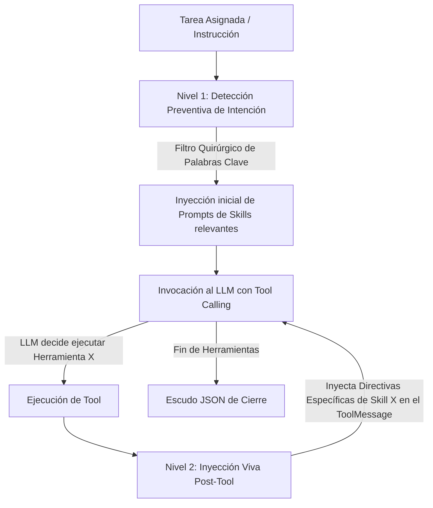

# Documentación Técnica: `subagente_asistencia_agent.py` y `Perfil_Subagente_Asistencia.py`

**Ubicación del Script Principal:** `Subagente_Asistencia/subagente_asistencia_agent.py`  
**Interfaz Canónica de Ejecución:** `Subagente_Asistencia/Perfil_Subagente_Asistencia.py`  
**Rol del Módulo:** Motor de Ejecución Cognitiva, Triaje y Gestión Ofimática  
**Subsistema:** Subagente de Asistencia Ejecutiva y Automatización  
**Identidad Canónica:** `Subagente_Asistencia`  
**Identidad Conversacional / Alias:** `Sanji`  

---

## 1. Propósito General

`subagente_asistencia_agent.py` constituye el núcleo ejecutable del Subagente de Asistencia. Es el encargado de procesar tareas delegadas por el Agente Orquestador a través de la Pizarra (`Bitacora.md`), gestionar la integración con Google Workspace (Calendar, Drive, Docs, Gmail), ejecutar lectura y OCR de documentos PDF, realizar consultas meteorológicas y búsquedas web, y compilar entregables ejecutivos en formato Markdown maquetado profesionalmente.

El módulo implementa un ciclo de vida efímero bajo demanda (**Spawn -> Exec -> Kill**) y un sistema de inyección dinámica de directivas operativas en dos niveles, garantizando economía estricta de tokens, cero pérdida de datos (**HS-01**) y verificación física de evidencia (**HS-02 Zero-Trust**).

---

## 2. Componentes y Arquitectura Interna

### 2.1. Carga de Identidad Canónica e Inmunización de Prompts
El agente no utiliza prompts cableados en código duro. Su identidad se carga dinámicamente:
- **SSOT de Identidad:** Carga el archivo canónico único `Subagente_Asistencia/_agents/agente.md`.
- **Estructura Libre de Duplicados:** Se erradicaron permanentemente los archivos redundantes (`sanji_agent.py`, `Subagente_Asistencia.md`), centralizando la configuración en un único archivo maestro de perfil.
- **Topología del Sistema:** Define claramente los directorios autorizados, roles de la tripulación y los 6 Hard-Stops inviolables.

### 2.2. Inyección Dinámica de Prompts en Dos Niveles
Para evitar el desbordamiento de contexto y minimizar los costos de inferencia, el agente aplica una arquitectura de inyección en dos capas:



1. **Nivel 1 (Pre-ejecución — Filtro Quirúrgico):** Analiza la orden asignada e inyecta preventivamente únicamente los system prompts de las habilidades requeridas (ej. si solo se pide agenda, solo inyecta Calendar; no satura el prompt con Docs, Drive o Clima).
2. **Nivel 2 (Inter-rondas en Vivo — `MAPA_HERRAMIENTA_PROMPTS`):** Cada vez que se ejecuta una herramienta (las 22 herramientas están mapeadas individualmente), el runtime inyecta las directivas operativas vivas de esa habilidad en la respuesta de la herramienta, guiando al LLM hacia la mejor práctica para la siguiente ronda de razonamiento.

### 2.3. Catálogo de Habilidades Modulares (11 Skills)
Cada habilidad se encuentra completamente desacoplada en su propio paquete bajo `Subagente_Asistencia/skills/<nombre_skill>/`:
1. **`base`:** Manipulación de archivos locales (`crear_archivo`, `leer_archivo`, `listar_directorio`, `ejecutar_comando`) con firewall determinístico.
2. **`obtener_clima`:** Consulta meteorológica en tiempo real vía Open-Meteo (`tool_obtener_clima`).
3. **`leer_pdf`:** Extracción de texto y metadatos con `pypdf` (`tool_leer_pdf_texto`, `tool_leer_pdf_pagina`, `tool_leer_pdf_metadatos`).
4. **`buscar_internet`:** Búsqueda técnica web vía DuckDuckGo Lite (`tool_buscar_internet`).
5. **`limpiar_workspace`:** Mantenimiento higiénico y purga de temporales (`tool_limpiar_workspace`).
6. **`sentry`:** Diagnóstico de excepciones y consulta semántica en base vectorial ChromaDB (`tool_consultar_sentry_errores`, `tool_registrar_solucion_error`, `tool_reportar_fallo_critico`).
7. **`google_workspace`:** Núcleo de autenticación OAuth 2.0 y factoría unificada de servicios. Aislado bajo `google_workspace/` para evitar colisiones con el paquete oficial de Python `google`.
8. **`google_calendar`:** Consulta y programación ejecutiva de citas (`tool_google_calendar_listar`, `tool_google_calendar_agendar`).
9. **`google_drive`:** Exploración y recuperación de documentos (`tool_google_drive_buscar`, `tool_google_drive_recientes`).
10. **`google_docs`:** Redacción y maquetación documental estructurada (`tool_google_docs`).
11. **`correo_electronico`:** Gestión integral de correo en Gmail: recepción, triaje con prioridades, notificación a mensajería (Telegram), respuesta en nombre del usuario (o borradores) y seguimiento de pendientes (`tool_correo_recibir_y_analizar`, `tool_correo_consultar_detalle`, `tool_correo_responder`, `tool_correo_notificar_usuario`, `tool_correo_seguimiento_pendientes`).

### 2.4. Firewall Determinístico y Zonas Seguras
El script incorpora un firewall estricto de rutas de entrada/salida implementado en `skill_base.py`:
- **Ruta Oficial de Entregables:** `/app/Subagente_Asistencia/documentos_asistencia/` (canónica autorizada).
- **Ruta de Informes Históricos:** `/app/Subagente_Asistencia/informes/`.
- **Ruta de Scratch / Temporales:** `/app/Archivos_temporales/` (requiere prefijo `asistencia_` o `sanji_`).
- **Comandos Destructivos Bloqueados:** Prohibición absoluta de comandos como `rm -rf`, `del /f`, `format` o eliminación física no autorizada.

### 2.5. Escudo JSON y Verificación Zero-Trust
Al finalizar el trabajo, el agente no emite texto libre; debe estructurar su salida mediante el Escudo JSON canónico:
```json
{
  "ticket_actualizado": "## TKT-XXX\n- **Tarea:** ...\n- **Responsable:** Subagente_Asistencia\n- **Estado:** COMPLETADO\n- **Evidencia_Fisica:** /app/Subagente_Asistencia/documentos_asistencia/informe.md\n- **Contexto:** ...\n- **Historial:** ...",
  "evidencia_hallazgo": "/app/Subagente_Asistencia/documentos_asistencia/informe.md"
}
```
El `base_listener.py` valida físicamente la existencia del archivo en disco (`os.path.exists`) y su tamaño antes de permitir el cambio de estado en `Bitacora.md`.

---

## 3. Modos de Ejecución

1. **Modo Subproceso Aislado (Spawn Efímero):**
   - Invocado por `base_listener.py` ante la detección de un ticket:
     ```bash
     python -u /app/Agente_Orquestador/base_listener.py Subagente_Asistencia --ticket ## TKT-ASI-XXXX
     ```
   - Ejecuta la tarea, actualiza la Pizarra, valida la evidencia y se apaga automáticamente liberando memoria.
2. **Modo Función de Nodo LangGraph (`funcion_nodo_subagente_asistencia`):**
   - Exportada para su invocación directa en arquitecturas de grafos de estados.
3. **Modo CLI / Manual (`Perfil_Subagente_Asistencia.py`):**
   - Permite pruebas directas en consola:
     ```bash
     python Perfil_Subagente_Asistencia.py "Consulta el clima de Caracas y resume las novedades."
     ```

---

## 4. Entradas y Salidas

- **Entradas:**
  - Contexto de mensajes del canal de la tripulación (`canal_comunicacion.json`).
  - Bloque de ticket asignado en `Bitacora.md` con especificación de requisitos.
  - Archivos de insumo en `Archivos_temporales/` (ej. PDFs para lectura).
- **Salidas:**
  - Entregables e informes ejecutivos en `documentos_asistencia/`.
  - Actualización formal del ticket en `Bitacora.md` con estado `COMPLETADO`.
  - Registro de soluciones y errores en ChromaDB / Sentry.
  - Bloque JSON validado por el Auditor del sistema.

---
**Pertenece a:** [[Perfil_Agente_Orquestador]]
