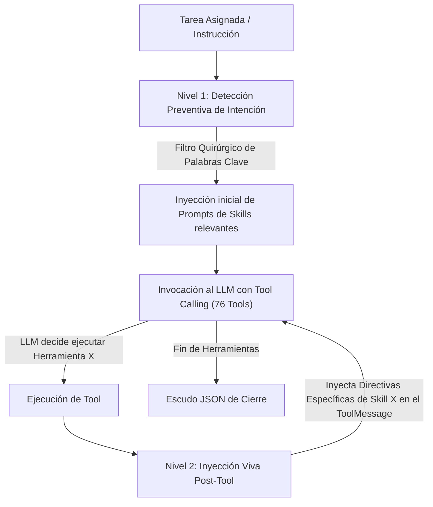

# Documentación Técnica: `subagente_desarrollo_agent.py` y `Perfil_Subagente_Desarrollo.py`

**Ubicación del Script Principal:** `Subagente_Desarrollo/subagente_desarrollo_agent.py`  
**Interfaz Canónica de Ejecución:** `Subagente_Desarrollo/Perfil_Subagente_Desarrollo.py`  
**Rol del Módulo:** Motor de Ejecución Cognitiva, Desarrollo Full-Stack y Orquestación n8n  
**Subsistema:** Subagente de Desarrollo de Software  
**Identidad Canónica:** `Subagente_Desarrollo`  
**Identidad Conversacional / Alias:** `Zoro`  

---

## 1. Propósito General

`subagente_desarrollo_agent.py` constituye el motor ejecutor principal del Subagente de Desarrollo. Su misión es procesar tareas delegadas por el Agente Orquestador mediante la Pizarra (`Bitacora.md`), desarrollando aplicaciones backend y frontend, estructurando proyectos móviles, gestionando repositorios Git, diseñando sistemas visuales UI/UX y creando flujos de automatización n8n.

El motor implementa un ciclo de vida efímero bajo demanda (**Spawn -> Exec -> Kill**) y un sistema de inyección dinámica de directivas operativas en dos niveles, asegurando economía estricta de tokens, cero pérdida de código (**HS-01**) y verificación física de entregables (**HS-02 Zero-Trust**).

---

## 2. Componentes y Arquitectura Interna

### 2.1. Carga de Identidad Canónica e Inmunización de Prompts
El agente no utiliza system prompts cableados en código duro. Su identidad se carga dinámicamente:
- **SSOT de Identidad:** Carga el archivo canónico único `Subagente_Desarrollo/_agents/agente.md`.
- **Estructura Libre de Duplicados:** Se erradicó permanentemente el script obsoleto `zoro_agent.py` y los archivos JSON planos de perfil antiguo, centralizando la configuración en `_agents/agente.md`.
- **Topología del Sistema:** Define claramente los directorios autorizados (`/app/Subagente_Desarrollo/proyectos/`), roles de la flota y los 8 Hard-Stops inviolables ([HS-01] a [HS-08]).

### 2.2. Inyección Dinámica de Prompts en Dos Niveles
Para evitar el desbordamiento de contexto y minimizar los costos de inferencia, el agente aplica una arquitectura de inyección en dos capas:



1. **Nivel 1 (Pre-ejecución — Filtro Quirúrgico):** Analiza la orden asignada e inyecta preventivamente únicamente los system prompts de las habilidades requeridas (ej. si la orden menciona "git commit" y "react", solo inyecta las directivas de Git y Web, protegiendo la ventana de contexto de n8n o Expo).
2. **Nivel 2 (Inter-rondas en Vivo — `MAPA_HERRAMIENTA_PROMPTS`):** Cada vez que se ejecuta una herramienta (las 71 herramientas de desarrollo están mapeadas individualmente a su habilidad), el runtime inyecta las directivas operativas vivas de esa habilidad en la respuesta de la herramienta, guiando al LLM hacia la mejor práctica para la siguiente ronda de razonamiento.

### 2.3. Catálogo de Habilidades Modulares (21 Skills)
Cada habilidad se encuentra completamente desacoplada en su propio paquete bajo `Subagente_Desarrollo/skills/<nombre_skill>/`:
1. **`base`:** Manipulación atómica de archivos y ejecución de comandos locales (`crear_archivo`, `leer_archivo`, `listar_directorio`, `ejecutar_comando`).
2. **`git`:** Control de versiones distribuido (`git_init`, `git_status`, `git_add`, `git_commit`, `git_log`, `git_branch`, `git_checkout`, `git_clone`, `git_pull`, `git_push`, `git_diff`).
3. **`software`:** Creación de entornos virtuales, instalación de paquetes y ejecución de scripts Python (`python_crear_venv`, `python_pip_instalar`, `python_ejecutar_script`).
4. **`web`:** Andamiaje de aplicaciones web en HTML5 estático y React + Vite (`web_scaffold_html`, `web_scaffold_react`).
5. **`mobile`:** Scaffolding de aplicaciones móviles multiplataforma nativas con Expo y React Native Bare (`mobile_scaffold_expo`, `mobile_scaffold_rn`).
5. **`frontend_design`:** Aplicación de cinco corrientes estéticas mundiales de UI/UX (`aplicar_frontend_design_anthropic`, `aplicar_ui_ux_pro_max`, `aplicar_emil_design_eng`, `aplicar_huashu_design`, `aplicar_vercel_guidelines`).
7. **`n8n`:** Creación, validación, guardado y activación de flujos de automatización n8n (`n8n_guardar_workflow`, `n8n_api_call`, `n8n_activar_workflow`, `n8n_iniciar`).
8. **`n8n_docs`:** Consulta oficial a la API de esquemas y parámetros de nodos n8n (`n8n_buscar_nodos`, `n8n_leer_parametros_nodo`).
9. **`n8n_templates`:** Búsqueda y reciclaje de plantillas de la galería comunitaria oficial (`n8n_buscar_plantillas`, `n8n_obtener_plantilla`).
10. **`n8n_updater`:** Auditoría de releases, changelogs y compatibilidad de nodos en GitHub (`n8n_obtener_ultimas_novedades`).
11. **`ngrok`:** Exposición perimetral temporal de puertos locales para webhooks (`ngrok_iniciar_tunel`, `ngrok_obtener_url`).
12. **`sentry`:** Diagnóstico de excepciones y consulta en la memoria vectorial ChromaDB (`tool_consultar_sentry_errores`, `tool_registrar_solucion_error`, `tool_reportar_fallo_critico`).
13. **`limpiar_workspace`:** Higiene de workspace y purga recursiva de cachés compiladas (`tool_limpiar_workspace`, `tool_limpiar_habitacion`).
14. **`animaciones`:** Animaciones GPU intencionales, Motion React y auditoría anti-slop de microinteracciones (`tool_generar_animacion_css`, `tool_generar_animacion_motion`, `tool_auditar_animaciones`, `tool_catalogo_recetas_animacion`).
15. **`taste`:** Criterio estético frontend, tokens CSS/Tailwind y prevención de defaults genéricos (`tool_taste_inferir_brief`, `tool_taste_generar_tokens`, `tool_taste_auditar_anti_defaults`, `tool_taste_catalogo_estilos`).
16. **`impeccable`:** Arquitectura UI en 4 modos de superficie (Operate, Persuade, Read, Experience) y destilación visual (`tool_impeccable_definir_superficie`, `tool_impeccable_auditar_diseno`, `tool_impeccable_harden_componente`, `tool_impeccable_distill_ui`).
17. **`playwright`:** Validación visual en navegadores reales, tests E2E, accesibilidad y responsive (`tool_playwright_generar_test`, `tool_playwright_verificar_responsive`, `tool_playwright_inspeccionar_accesibilidad`, `tool_playwright_configurar_mcp`).
18. **`conectores_mcp_api`:** Conexión segura a APIs y servidores MCP con escaneo SAST preventivo de Ciberseguridad (`tool_solicitar_auditoria_ciberseguridad`, `tool_conectar_api_rest`, `tool_conectar_servidor_mcp`, `tool_probar_conexion_segura`).
19. **`bases_de_datos_sql`:** SQL seguro parametrizado, optimización y motor Polars SQL para Big Data (`tool_sql_ejecutar_consulta`, `tool_sql_procesar_grandes_datos`, `tool_sql_analizar_rendimiento`, `tool_sql_migracion_y_esquema`).
20. **`auto_aprendizaje`:** Memoria procedural de playbooks y blueprints para ejecución One-Shot (`tool_consultar_playbook_memoria`, `tool_registrar_playbook_memoria`).
21. **`solicitar_soporte_pizarra`:** Pausa operativa y delegación de tickets en Pizarra ante bloqueos (`tool_solicitar_ayuda_pizarra`, `tool_consultar_estado_ticket_pizarra`).

---

## 3. Lógica Detallada del Ciclo de Ejecución (`ejecutar_ciclo`)

El flujo de ejecución de `ejecutar_ciclo` opera con las siguientes garantías:
1. **Instanciación Limpia:** Crea el cliente OpenAI compatible (`deepseek-chat` u otro proveedor configurado en `.env`).
2. **Inyección Nivel 1:** Llama a `construir_system_prompt(instruccion=mensaje_entrada)` combinando el SSOT con los prompts detectados.
3. **Conversión Dinámica de Schemas:** La función `_herramientas_schema()` genera automáticamente schemas JSON para OpenAI a partir de las 76 herramientas registradas (inspeccionando firmas y docstrings o `args_schema` de LangChain).
4. **Bucle de Razonamiento (Hasta 50 Rondas):**
   - Ejecuta llamadas a herramientas vía `_procesar_tool_calls()`.
   - Inyecta Nivel 2 dinámicamente en el `content` de cada tool call completada.
   - Rastrea el consumo de tokens con `costos_tracker.registrar_consumo_tokens()`.
5. **Escudo JSON y Validación Zero-Trust:**
   - Exige que la respuesta final sea un JSON válido con `ticket_actualizado` y `evidencia_hallazgo`.
   - Si el modelo omite el campo `evidencia_hallazgo` o responde con texto plano, el motor re-solicita automáticamente la corrección.
   - Si el JSON viene embebido en Markdown, lo decodifica de forma segura con `json.JSONDecoder().raw_decode()`.

---

## 4. Nodo LangGraph (`funcion_nodo_subagente_desarrollo`)

Para su integración en el grafo de tripulación orquestado por LangGraph:
- Recibe el `estado: dict` con el historial de mensajes de la tarea.
- Lee los mensajes entrantes en su canal de memoria compartida (`Subagente_Desarrollo` o `Zoro`).
- Invoca `ejecutar_ciclo()` con la instrucción consolidada.
- Retorna el diccionario de actualización de estado:
  ```python
  {"messages": [AIMessage(content=respuesta_final, name="Subagente_Desarrollo")]}
  ```
- Exporta el alias de retrocompatibilidad `funcion_nodo_zoro = funcion_nodo_subagente_desarrollo`.

---

## 5. Uso desde CLI e Interfaz `Perfil_Subagente_Desarrollo.py`

`Perfil_Subagente_Desarrollo.py` sirve como la fachada limpia para invocar al agente desde la línea de comandos o importar su nodo:

```bash
# Ejecución directa con una instrucción técnica
python Subagente_Desarrollo/Perfil_Subagente_Desarrollo.py "Crea un scaffold web HTML5 con diseño dark mode en proyectos/demo_web"

# O usando el script principal
python Subagente_Desarrollo/subagente_desarrollo_agent.py "Inicializa un repositorio Git en proyectos/mi_api y genera el .gitignore"
```

---
**Pertenece a:** [[Perfil_Agente_Orquestador]]
